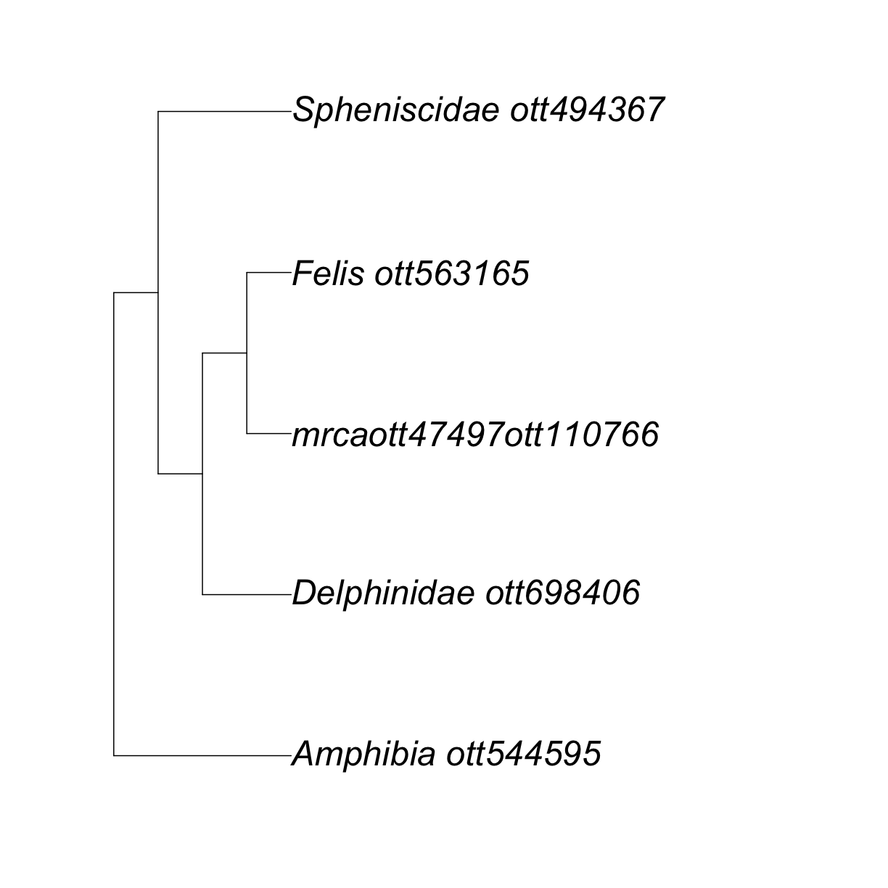

---
# Please do not edit this file directly; it is auto generated.
# Instead, please edit 02-get-induced.md in _episodes_rmd/
source: Rmd
title: "Getting a piece of the Synthetic Open Tree of Life"
teaching: 5
exercises: 5
questions:
- "What is the synthetic Open Tree of Life?"
- "How do I interact with it?"
- "Why is my taxon not in the tree?"
objectives:
- "Get an induced subtree"
- "Get a subtree"
keypoints:
- "OTT ids and node ids allow us to interact with the synthetic OpenTree."
- "Portions of the synthetic OpenTree can be extracted from a single OTT id or from a bunch of OTT ids"
- "It is not possible to get a subtree from an OTT id that is not in the synthetic tree."
---

~~~
## 
## Attaching package: 'datelifeplot'
~~~
{: .output}

~~~
## The following objects are masked from 'package:datelife':
## 
##     axisGeo, HPDbars, plot_densitree, plot_ltt_phyloall,
##     plot_ltt_summary, plot_phylo, plot_phylo_all, wrap_string_to_plot
~~~
{: .output}
 
 

The synthetic Open Tree of Life (**synthetic OpenTree** from now on) summarizes information from **1239**
trees from **1184** peer-reviewed and published studies, that have been uploaded to the OpenTree database (the Phylesystem) through a [curator system](https://tree.opentreeoflife.org/curator).

Functions from the `rotl` package that interact with the synthetic OpenTree start with `tol_`.

To access general information about the current synthetic OpenTree, we can use the function `tol_about()`. This function requires no argument.

~~~
rotl::tol_about()
~~~
{: .language-r}

~~~

OpenTree Synthetic Tree of Life.

Tree version: opentree13.4
Taxonomy version: 3.3draft1
Constructed on: 2021-06-18 11:13:49
Number of terminal taxa: 2392042
Number of source trees: 1239
Number of source studies: 1184
Source list present: false
Root taxon: cellular organisms
Root ott_id: 93302
Root node_id: ott93302
~~~
{: .output}
This is nice!

As you can note, the current synthetic OpenTree was created not too long ago, on 2021-06-18 11:13:49.

This is also telling us that there are currently more than **2 million tips** on the synthetic OpenTree.

It is indeed a large tree. So, **_what if we just want a small piece of the whole synthetic OpenTree?_**

Well, now that we have some interesting taxon OTT ids, we can easily do this.

### Getting an induced subtree

The function `tol_induced_subtree()` allows us to get a tree of taxa from different taxonomic ranks.

~~~
resolved_names$ott_id
my_tree <- rotl::tol_induced_subtree(ott_ids = resolved_names$ott_id)
~~~
{: .language-r}

~~~
Warning in collapse_singles(tr, show_progress): Dropping singleton nodes
with labels: Mammalia ott244265, Theria (subclass in Deuterostomia)
ott229558, Eutheria (in Deuterostomia) ott683263, Boreoeutheria ott5334778,
Laurasiatheria ott392223, mrcaott1548ott6790, mrcaott1548ott3607484,
mrcaott1548ott4942380, mrcaott1548ott4942547, mrcaott1548ott3021, Artiodactyla
ott622916, mrcaott1548ott21987, mrcaott1548ott5256, mrcaott5256ott4944931,
Whippomorpha ott7655791, Cetacea ott698424, mrcaott5256ott3615450,
mrcaott5256ott44568, Odontoceti ott698417, mrcaott5256ott5269,
mrcaott5269ott6470, mrcaott5269ott47843, mrcaott47843ott194312,
mrcaott4697ott263949, Carnivora ott44565, Caniformia ott827263,
Canidae ott770319, mrcaott47497ott3612617, mrcaott47497ott3612529,
mrcaott47497ott3612596, mrcaott47497ott3612516, mrcaott47497ott3612589,
mrcaott47497ott3612591, mrcaott47497ott3612592, mrcaott47497ott77889,
Feliformia ott827259, mrcaott6940ott19397, mrcaott19397ott194349, Felidae
ott563159, mrcaott54737ott660452, mrcaott54737ott86170, mrcaott54737ott86175,
mrcaott54737ott442049, mrcaott54737ott86162, mrcaott54737ott86166, Sauropsida
ott639642, Sauria ott329823, mrcaott246ott4128455, mrcaott246ott4127082,
mrcaott246ott4129629, mrcaott246ott4142716, mrcaott246ott4126667,
mrcaott246ott1662, mrcaott246ott2982, mrcaott246ott31216, mrcaott246ott4947920,
mrcaott246ott4127428, mrcaott246ott4126230, mrcaott246ott4127421,
mrcaott246ott664349, mrcaott246ott4126505, mrcaott246ott4127015,
mrcaott246ott4129653, mrcaott246ott4127541, mrcaott246ott4946623,
mrcaott246ott4126482, mrcaott246ott4128105, mrcaott246ott4127288,
mrcaott246ott4132146, mrcaott246ott3602822, mrcaott246ott4143599,
mrcaott246ott3600976, mrcaott246ott4132107, Aves ott81461, Neognathae
ott241846, mrcaott246ott5481, mrcaott246ott5021, mrcaott246ott7145,
mrcaott246ott5272, mrcaott5272ott9830, mrcaott9830ott86672, mrcaott9830ott90560,
mrcaott9830ott18206, mrcaott18206ott60413, Sphenisciformes ott494366
~~~
{: .warning}

 

> ## Note: What does this warning mean?
>
> This warning has to do with the way the synthetic OpenTree is generated.
> You can look at the [overview of the synthesis algorithm](https://docs.google.com/presentation/d/1RwoNTUK3LKgBupBNOc1TNsIpucuMUddlYW6rC56We10/edit?usp=sharing) for more information.
>
>
{: .discussion}

 

Let's look at the output of `tol_induced_subtree()`.

~~~
my_tree
~~~
{: .language-r}

~~~

Phylogenetic tree with 5 tips and 4 internal nodes.

Tip labels:
  Delphinidae_ott698406, mrcaott47497ott110766, Felis_ott563165, Spheniscidae_ott494367, Amphibia_ott544595
Node labels:
  Tetrapoda ott229562, Amniota ott229560, mrcaott1548ott4697, mrcaott4697ott6940

Rooted; no branch lengths.
~~~
{: .output}

R is telling us that we have a rooted tree with no branch lengths and 5 tips.
If we check the class of the output, we will verify that it is a **'phylo' object**.

~~~
class(my_tree)
~~~
{: .language-r}

~~~
[1] "phylo"
~~~
{: .output}

A 'phylo' object is a data structure that stores the necessary information to build a tree.
There are several functions from different packages to plot trees or 'phylo' objects in R (e.g., [phytools](https://cran.r-project.org/web/packages/phytools/phytools.pdf)). For now, we will use the one from the legendary `ape` package `plot.phylo()`:

~~~
ape::plot.phylo(my_tree, cex = 2) # or just plot(my_tree, cex = 2)
~~~
{: .language-r}

This is cool!

But, why oh why did my _Canis_ disappear? 😢

Well, it did not actually disappear, it was replaced by the label "mrcaott47497ott110766".

We will explain why this happens in the [next section](../03-broken-taxa/index.html).

Now, **_what if you want a piece of the synthetic OpenTree containing all descendants of your taxa of interest?_**

### Getting a subtree of one taxon

We can extract a subtree of all descendants of one taxon at a time using the function `tol_subtree()` and an OTT id of your choosing.

Let's extract a subtree of all amphibians.

First, get its OTT id. It is already stored in our `resolved_names` object:

~~~
amphibia_ott_id <- resolved_names["Amphibia",]$ott_id
~~~
{: .language-r}
Or,  you can run the function `tnrs_match_names()` again if you want.

~~~
amphibia_ott_id <- rotl::tnrs_match_names("amphibians")$ott_id
~~~
{: .language-r}

 

Now, extract the subtree from the synthetic OpenTree using `tol_subtree()`.

~~~
amphibia_subtree <- rotl::tol_subtree(ott_id = resolved_names["Amphibia",]$ott_id)
~~~
{: .language-r}
Let's look at the output:

~~~
amphibia_subtree
~~~
{: .language-r}

~~~

Phylogenetic tree with 10020 tips and 4669 internal nodes.

Tip labels:
  Odorrana_geminata_ott114, Odorrana_chapaensis_ott214633, Odorrana_grahami_ott43280, Odorrana_margaretae_ott440550, Odorrana_kuangwuensis_ott3618367, Odorrana_junlianensis_ott656728, ...
Node labels:
  Amphibia ott544595, Batrachia ott471197, Anura ott991547, , , , ...

Unrooted; no branch lengths.
~~~
{: .output}
This is a large tree! We will have a hard time plotting it.

 

Now, let's extract a subtree for the genus _Canis_. It should be way smaller!

~~~
subtree <- rotl::tol_subtree(resolved_names["Canis",]$ott_id)
~~~
{: .language-r}

~~~
Error: HTTP failure: 400
list(contesting_trees = list(`ot_278@tree1` = list(attachment_points = list(list(children_from_taxon = list("node242"), parent = "node241"), list(children_from_taxon = list("node244"), parent = "node243"), list(children_from_taxon = list("node262"), parent = "node255"), list(children_from_taxon = list("node270"), parent = "node267"))), `ot_328@tree1` = list(attachment_points = list(list(children_from_taxon = list("node519"), parent = "node518"), list(children_from_taxon = list("node523"), parent = "node522")))), 
    mrca = "mrcaott47497ott110766")[/v3/tree_of_life/subtree] Error: node_id was not found (broken taxon).
~~~
{: .error}

## 😱 😱 😱

What does this error mean??

A "broken" taxon error usually happens when phylogenetic information does not match taxonomic information.

For example, extinct lineages are sometimes phylogenetically included within a taxon but are taxonomically excluded, making the taxon appear as paraphyletic.

On the [Open Tree of Life browser](https://tree.opentreeoflife.org/opentree/argus/ottol@372706), we can still get to the subtree ([check it out here](https://tree.opentreeoflife.org/opentree/argus/opentree12.3@mrcaott47497ott110766)).

From R, we will need to do something else first. We will get to that on the next episode.

 
