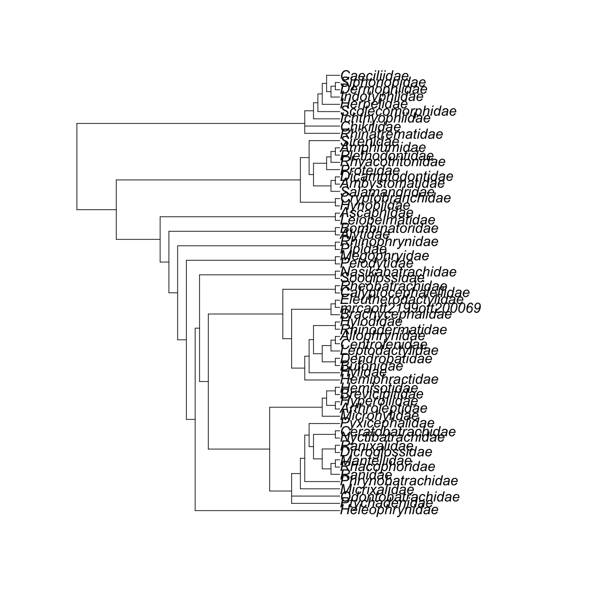
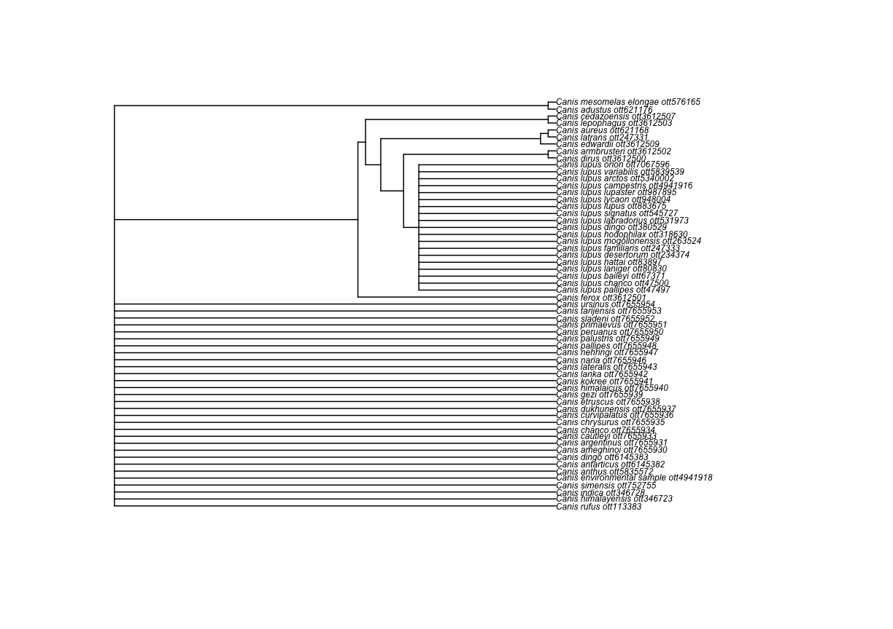

---
# Please do not edit this file directly; it is auto generated.
# Instead, please edit 03-broken-taxa.md in _episodes_rmd/
source: Rmd
title: 'Dealing with "broken" and "invalid" taxa'
teaching: 5
exercises: 5
questions:
- "Why are my taxa not in the tree?"
objectives:
- "Know what functions are available to get taxon information"
- "Understand outputs from those functions"
keypoints:
- "taxonomic tree..."
---

There is a way to find out that a group is "broken" before trying to get the subtree and getting an error.

~~~
rotl::is_in_tree(canis$ott_id)
~~~
{: .language-r}
We say that a taxon is not in the tree when its _ott id_ is not assigned to a node in the synthetic tree.
This is the reason why we get an error when we try to get a subtree using the _ott id_.

Then, how do I get a subtree of my "broken" taxon?
There are some options.

## a) Get a subtree using the _node id_ instead of the _ott id_
`rotl` has a function that gets for you all info from the node containing a taxon. That includes the actual _node id_.

~~~
canis_node_info <- rotl::tol_node_info(canis$ott_id)
canis_node_info
~~~
{: .language-r}

~~~

OpenTree node.

Node id: mrcaott47497ott110766
Number of terminal descendants: 85
Is taxon: FALSE
~~~
{: .output}
The _node_ that contains _Canis_ is "mrcaott47497ott110766". We can use it to get a subtree with `tol_subtree()`

~~~
canis_node_subtree <- rotl::tol_subtree(node_id = canis_node_info$node_id)
~~~
{: .language-r}

~~~
ape::plot.phylo(canis_node_subtree, cex = 0.5)
~~~
{: .language-r}

Nice! We got a subtree of 85 tips, containing all descendants from the node that also contains _Canis_.

This includes species assigned to genera other than _Canis_.

What if I _really, really_ want to get a tree containing species within the genus _Canis_ only?

## b) Get an induced subtree of taxonomic children

We can get the _ott ids_ of the taxonomic children of our taxon of interest and use the function `tol_induced_subtree()`.

First, get the taxonomic children.

~~~
canis_taxonomy <- rotl::taxonomy_subtree(canis$ott_id)
~~~
{: .language-r}

~~~
canis_taxonomy
~~~
{: .language-r}

$tip_label
 [1] "Canis_dirus_ott3612500"                         
 [2] "Canis_anthus_ott5835572"                        
 [3] "Canis_rufus_ott113383"                          
 [4] "Canis_simensis_ott752755"                       
 [5] "Canis_aureus_ott621168"                         
 [6] "Canis_mesomelas_elongae_ott576165"              
 [7] "Canis_adustus_ott621176"                        
 [8] "unclassified_Canis_ott7655955"                  
 [9] "Canis_latrans_ott247331"                        
[10] "Canis_lupus_baileyi_ott67371"                   
[11] "Canis_lupus_laniger_ott80830"                   
[12] "Canis_lupus_orion_ott7067596"                   
[13] "Canis_lupus_hodophilax_ott318630"               
[14] "Canis_lupus_signatus_ott545727"                 
[15] "Canis_lupus_arctos_ott5340002"                  
[16] "Canis_lupus_mogollonensis_ott263524"            
[17] "Canis_lupus_variabilis_ott5839539"              
[18] "Canis_lupus_lupus_ott883675"                    
[19] "Canis_lupus_campestris_ott4941916"              
[20] "Canis_lupus_lycaon_ott948004"                   
[21] "Canis_lupus_pallipes_ott47497"                  
[22] "Canis_lupus_chanco_ott47500"                    
[23] "Canis_lupus_x_Canis_lupus_familiaris_ott4941915"
[24] "Canis_lupus_desertorum_ott234374"               
[25] "Canis_lupus_familiaris_ott247333"               
[26] "Canis_lupus_dingo_ott380529"                    
[27] "Canis_lupus_labradorius_ott531973"              
[28] "Canis_lupus_hattai_ott83897"                    
[29] "Canis_lupus_lupaster_ott987895"                 
[30] "Canis_himalayensis_ott346723"                   
[31] "Canis_indica_ott346728"                         
[32] "Canis_environmental_samples_ott4941917"         
[33] "Canissp.KEB-2016ott5925604"                     
[34] "Canis_sp._CANInt1_ott470950"                    
[35] "'Canissp.Russia/33"                             
[36] "500ott5338950'"                                 
[37] "Canis_sp._ott247325"                            
[38] "'Canissp.Belgium/36"                            
[39] "000ott5338951'"                                 
[40] "Canis_environmental_sample_ott4941918"          
[41] "Canis_morenis_ott6145387"                       
[42] "Canis_niger_ott6145388"                         
[43] "Canis_palaeoplatensis_ott6145390"               
[44] "Canis_osorum_ott6145389"                        
[45] "Canis_thooides_ott6145392"                      
[46] "Canis_antarcticus_ott6145381"                   
[47] "Canis_proplatensis_ott6145391"                  
[48] "Canis_feneus_ott6145384"                        
[49] "Canis_geismarianus_ott6145385"                  
[50] "Canis_ameghinoi_ott7655930"                     
[51] "Canis_nehringi_ott7655947"                      
[52] "Canis_palustris_ott7655949"                     
[53] "Canis_lanka_ott7655942"                         
[54] "Canis_pallipes_ott7655948"                      
[55] "Canis_gezi_ott7655939"                          
[56] "Canis_montanus_ott7655945"                      
[57] "Canis_primaevus_ott7655951"                     
[58] "Canis_chrysurus_ott7655935"                     
[59] "Canis_dukhunensis_ott7655937"                   
[60] "Canis_kokree_ott7655941"                        
[61] "Canis_sladeni_ott7655952"                       
[62] "Canis_himalaicus_ott7655940"                    
[63] "Canis_chanco_ott7655934"                        
[64] "Canis_curvipalatus_ott7655936"                  
[65] "Canis_lateralis_ott7655943"                     
[66] "Canis_argentinus_ott7655931"                    
[67] "Canis_tarijensis_ott7655953"                    
[68] "Canis_naria_ott7655946"                         
[69] "Canis_peruanus_ott7655950"                      
[70] "Canis_cautleyi_ott7655933"                      
[71] "Canis_ursinus_ott7655954"                       
[72] "Canis_armbrusteri_ott3612502"                   
[73] "Canis_ferox_ott3612501"                         
[74] "Canis_lepophagus_ott3612503"                    
[75] "Canis_edwardii_ott3612509"                      
[76] "Canis_apolloniensis_ott3612508"                 
[77] "Canis_cedazoensis_ott3612507"                   
[78] "Canis_primigenius_ott3612506"                   
[79] "Canis_lydekkeri_ott7655944"                     
[80] "Canis_arnensis_ott7655932"                      
[81] "Canis_antarticus_ott6145382"                    
[82] "Canis_dingo_ott6145383"                         
[83] "Canis_etruscus_ott7655938"                      
[84] "Canis_spelaeus_ott3612504"                      

$edge_label
[1] "Canis_mesomelas_ott666235" "Canis_lupus_ott247341"    
[3] "Canis_ott372706"          
Now, extract the _ott ids_.

~~~
canis_taxonomy_ott_ids <- datelife::extract_ott_ids(x = canis_taxonomy$tip_label)
~~~
{: .language-r}

~~~
After extracting ott ids, there are some non numeric elements:
~~~
{: .output}

~~~
	 Canissp.KEB-2016ott5925604
	 'Canissp.Russia/33
	 500ott5338950'
	 'Canissp.Belgium/36
	 000ott5338951'
~~~
{: .output}

~~~

NAs removed.
~~~
{: .output}
Try to get an induced subtree of _Canis_ taxonomic children.

~~~
canis_taxonomy_subtree <- rotl::tol_induced_subtree(canis_taxonomy_ott_ids)
~~~
{: .language-r}

~~~
Error: HTTP failure: 400
[/v3/tree_of_life/induced_subtree] Error: node_id 'ott3612504' was not found!list(ott247325 = "pruned_ott_id", ott3612504 = "pruned_ott_id", ott3612506 = "pruned_ott_id", ott3612508 = "pruned_ott_id", ott470950 = "pruned_ott_id", ott4941915 = "pruned_ott_id", ott4941917 = "pruned_ott_id", ott6145381 = "pruned_ott_id", ott6145384 = "pruned_ott_id", ott6145385 = "pruned_ott_id", ott6145387 = "pruned_ott_id", ott6145388 = "pruned_ott_id", ott6145389 = "pruned_ott_id", ott6145390 = "pruned_ott_id", ott6145391 = "pruned_ott_id", ott6145392 = "pruned_ott_id", ott7655932 = "pruned_ott_id", 
    ott7655944 = "pruned_ott_id", ott7655945 = "pruned_ott_id", ott7655955 = "pruned_ott_id")
~~~
{: .error}
It is often not possible to get an induced subtree of all taxonomic children from a taxon,
because some of them are not in the tree.

To verify which ones are giving us trouble, we can use the function `is_in_tree()` again.

~~~
canis_in_tree <- sapply(canis_taxonomy_ott_ids, rotl::is_in_tree)
canis_taxonomy_ott_ids_intree <- canis_taxonomy_ott_ids[canis_in_tree]
canis_taxonomy_subtree <- rotl::tol_induced_subtree(canis_taxonomy_ott_ids_intree)
~~~
{: .language-r}

~~~
ape::plot.phylo(canis_taxonomy_subtree, cex = 0.5)
~~~
{: .language-r}

There! We have a synthetic subtree (derived from phylogenetic information) containing only the taxonomic children of _Canis_.
