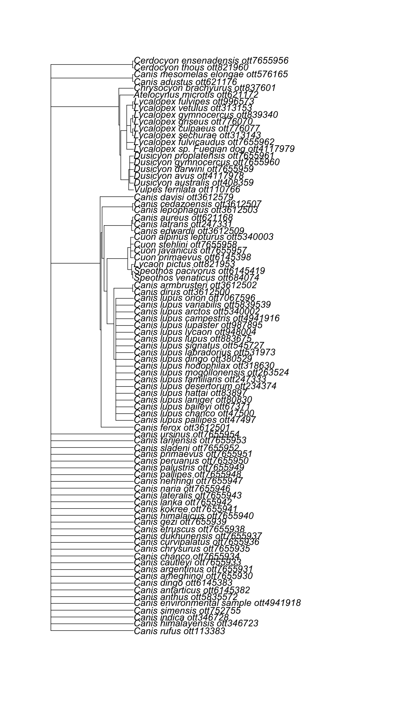
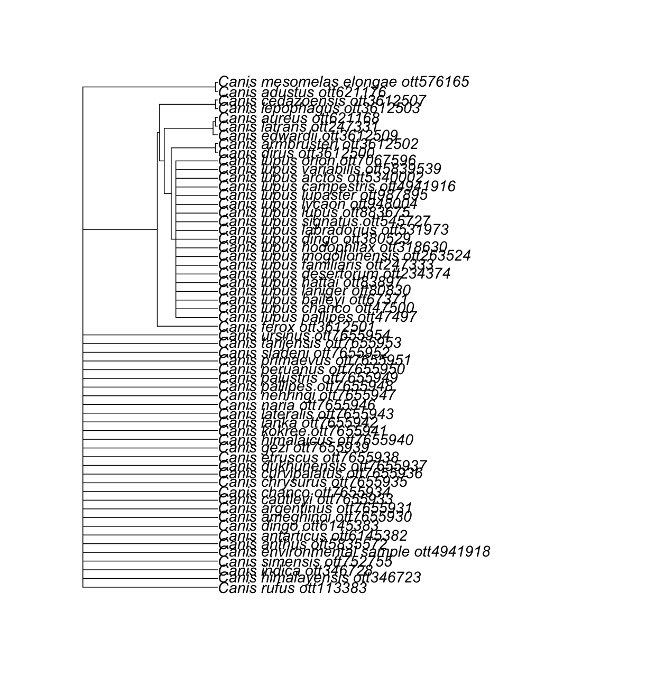

---
# Please do not edit this file directly; it is auto generated.
# Instead, please edit 03-broken-taxa.md in _episodes_rmd/
source: Rmd
title: 'Dealing with "broken" and "invalid" taxa'
teaching: 5
exercises: 5
questions:
- "How do I detect a broken taxon?"
objectives:
- "Use the function is_in_tree()"
- "Understand outputs from those functions"
keypoints:
- "It is not possible to get a subtre from an OTT id that is not in the synthetic tree."
- "OTT ids and node ids allow us to interact with the synthetic OpenTree."
---

~~~
## Warning in collapse_singles(tr, show_progress): Dropping singleton nodes
## with labels: Rana clamitans ott515378, Rana sphenocephala ott61437, Rana
## aurora ott771201, Glandirana ott407917, Pterorana ott3618410, Pelophylax
## cf ott7070897, Hemimantis ott4133632, Microdiscopus ott4133623, Montorana
## ott4133633, Chiromantis vittatus ott389176, Mercurana ott4133643, Beddomixalus
## ott4133641, Buergeriinae ott223222, Maitsomantis ott678997, Boehmantis
## ott484429, laevigata group ott189959, bernhardi group ott189958, Wakea
## ott484449, Tsingymantis ott976861, Boophinae ott764200, Laliostoma ott1054409,
## Ombrana ott4133654, Chrysopaa ott4133659, Alcalinae ott5926144, Liurananinae
## ott5926192, Natalobatrachus ott532110, Nothophryne ott3618085, Cacosternum
## nanum ott676305, Microbatrachella ott751405, Poyntonia ott475120, Anhydrophryne
## ott113819, Ericabatrachus ott3618087, Phrynobatrachidae ott504589, Micrixalidae
## ott1081209, Odontobatrachidae ott5536254, Lanzarana ott3618164, Trichobatrachus
## ott780979, Pararthroleptis ott4133674, Hyperolius fusciventris ott85268,
## Chlorolius ott3619081, Tachycnemis (genus in Deuterostomia) ott750024, Morerella
## ott85260, Kassinula ott3619075, Opisthothylax ott645881, Chrysobatrachus
## ott3619077, Callixalus ott3619073, Arlequinus ott3619083, Semnodactylus
## ott62328, Tornierella ott4133669, Breviceps adspersus ott3618690, Spelaeophryne
## ott660153, Probreviceps macrodactylus ott111206, Balebreviceps ott348136,
## Hemisotidae ott165721, Oninia ott789802, Genyophryne ott21522, Siamophryne
## ott7070469, Melanobatrachus ott701612, Kalophrynidae ott977735, Phrynella (genus
## in Opisthokonta) ott401609, Mysticellus ott7070618, Dermatonotus ott186184,
## Gastrophryne olivacea ott565409, Arcovomer ott844415, Adelastinae ott5800508,
## Adelastes ott3618939, Dasypops ott513414, Relictivomer ott190096, Anilany
## ott5926118, Madecassophryne ott3618941, Parhoplophryne ott3618937, Otophryninae
## ott404351, Phrynomerinae ott630304, Caluella ott7666463, Corythomantis
## ott442032, Argenteohyla ott578372, Argenteohyla siemersi ott100569, Nyctimantis
## ott1087156, Itapotihyla ott257368, Hyla annectans ott655531, Anotheca ott59159,
## Diaglena ott3620134, Acris crepitans ott59141, Quilticohyla ott7070260, Rheohyla
## ott7070262, Nesorohyla ott7070190, Pachymedusa ott254792, Dryaderces ott7666055,
## Didynamipus ott152264, Barbarophryne ott5800473, Churamiti ott104959, Bufotes
## pewzowi ott1072351, Schismaderma ott506368, Sabahphrynus ott4133471, Strauchbufo
## ott6158681, Epidalea ott334615, Anaxyrus americanus ott889326, Laurentophryne
## ott3619734, Parapelophryne ott3619737, Pseudobufo ott3619739, Bufoides
## ott3619731, Metaphryniscus ott3619751, Blythophryne ott5926045, Ghatophryne
## ott7069948, Rentapia ott7069968, Silverstoneia nubicola ott638061, Hyloxalinae
## ott1096759, Lithodytes ott315881, Scythrophrys ott462991, Rupirana ott3620326,
## Phrynocerus ott3619498, Physalalemus ott6158772, Niedenia ott4133301,
## Allophrynidae ott57740, Macrogenioglottus ott726713, Insuetophrynus ott44381,
## Telmatobiinae ott777187, Hylorina ott440882, Chaltenobatrachus ott6158620,
## Limnomedusa ott914517, Chacophrys ott431943, Caudiverbera ott1068325,
## Atopophrynus ott3620196, Geobatrachus ott3620197, Ceuthomantinae ott277741,
## Megistolotis ott276283, Adelotus ott276281, Assa (genus in Opisthokonta)
## ott906692, Paracrinia ott989413, Metacrinia ott412471, Spicospina ott1039925,
## Rheobatrachidae ott918183, Hadromophryne ott971912, Atympanophrys ott542885,
## Vibrissaphora ott535112, Pelodytidae ott509554, Xenopodinae ott940173,
## Pseudhymenochirus ott140873, Rhinophrynidae ott459016, Rhinophrynus ott459015,
## Alytinae ott5334814, Discoglossus galganoi ott461369, Latonia ott4948216,
## Leiopelmatidae ott611960, Ascaphidae ott1013114, Pelodryadidae ott3620482,
## Ranoidea (genus in family Pelodryadidae) ott7666856, Iranodon ott7071233,
## Ranodon ott834698, Satobius ott5800418, Pachyhynobius ott1021854, Ambystomatidae
## ott984723, Dicamptodontidae ott60819, Laotriton ott4948201, Triturus marmoratus
## ott1041767, Triturus carnifex ott1041783, Ommatotriton ophryticus ott645229,
## Lissotriton helveticus ott9366, Lissotriton boscai ott830424, Tylototriton
## verrucosus ott932561, Tylototriton wenxianensis ott981376, Pleurodeles waltl
## ott566038, Lyciasalamandra fazilae ott1024882, Salamandrininae ott4948210,
## Pingia ott4132654, Isthmura bellii ott46162, Isthmura sierraoccidentalis
## ott98841, Parvimolge ott46159, Bradytriton ott798666, Nyctanolis ott224306,
## Haideotriton ott133635, Eurycea multiplicata ott839995, Stereochilus (genus
## in Opisthokonta) ott798664, Hemidactylium ott798658, Phaeognathus ott964128,
## Karsenia ott893551, Ensatina ott64118, Hydromantes imperialis ott675243,
## Atylodes (genus in Deuterostomia) ott693464, Hydromantoides ott4132648,
## Amphiumidae ott566022, Rhyacotritonidae ott459010, Sirenoidea ott336754,
## Chikilidae ott4948197, Praslinia ott80530, Sylvacaecilia ott3617918,
## Atretochoana ott3617929, Potamotyphlus ott7667119, Bdellophis ott4132629
~~~
{: .warning}

~~~
## Warning in collapse_singles(tr, show_progress): Dropping singleton nodes with
## labels: Lycaon ott821959, Cuon alpinus ott313163, Eucyon ott3612566, Atelocynus
## ott621180, Chrysocyon ott621163, Canis mesomelas ott666235
~~~
{: .warning}

 
 

We say that a taxon is _"broken"_ when its OTT id is not assigned to any node in the OpenTree synthetic tree.
As mentioned before, this happens when the OTT id belongs to a taxon that is not monophyletic in the current version of the synthetic OpenTree.
This is the reason why we get an error when we try to get an OpenTree synthetic subtree including the OTT id of the genus _Canis_ --it is **not monophyletic** in the tree.

There is a way to find out that a group is "broken" before trying to get the subtree and getting an error.

~~~
rotl::is_in_tree(resolved_names["Canis",]$ott_id)
~~~
{: .language-r}

~~~
[1] FALSE
~~~
{: .output}

Indeed, our _Canis_ is **not** in the synthetic OpenTree. To extract a subtree of a "broken" taxon, we have some options. But we will focus on one.

### Getting the MRCA of a taxon

The function `tol_node_info()` gets for you all relevant information of the node that is the ancestor or MRCA of a taxon. That also includes the actual node id.

~~~
canis_node_info <- rotl::tol_node_info(resolved_names["Canis",]$ott_id)
canis_node_info
~~~
{: .language-r}

~~~

OpenTree node.

Node id: mrcaott47497ott110766
Number of terminal descendants: 85
Is taxon: FALSE
~~~
{: .output}
Let's explore the class of the output.

~~~
class(canis_node_info)
~~~
{: .language-r}

~~~
[1] "tol_node" "list"    
~~~
{: .output}

 

So we have an object of class 'list' and 'tol_node'. When we printed it, we got some
information. But we do not know how much information might not be "printed" to screen.

 

Let's use the functions `str()` or `ls()` to check out the data strcture of our 'tol_node' object.

~~~
str(canis_node_info)
~~~
{: .language-r}

~~~
List of 8
 $ node_id      : chr "mrcaott47497ott110766"
 $ num_tips     : int 85
 $ query        : chr "ott372706"
 $ resolves     :List of 1
  ..$ pg_2812@tree6545: chr "node1135827"
 $ source_id_map:List of 5
  ..$ ot_278@tree1    :List of 3
  .. ..$ git_sha : chr ""
  .. ..$ study_id: chr "ot_278"
  .. ..$ tree_id : chr "tree1"
  ..$ ot_328@tree1    :List of 3
  .. ..$ git_sha : chr ""
  .. ..$ study_id: chr "ot_328"
  .. ..$ tree_id : chr "tree1"
  ..$ pg_1428@tree2855:List of 3
  .. ..$ git_sha : chr ""
  .. ..$ study_id: chr "pg_1428"
  .. ..$ tree_id : chr "tree2855"
  ..$ pg_2647@tree6169:List of 3
  .. ..$ git_sha : chr ""
  .. ..$ study_id: chr "pg_2647"
  .. ..$ tree_id : chr "tree6169"
  ..$ pg_2812@tree6545:List of 3
  .. ..$ git_sha : chr ""
  .. ..$ study_id: chr "pg_2812"
  .. ..$ tree_id : chr "tree6545"
 $ supported_by :List of 2
  ..$ ot_278@tree1: chr "node233"
  ..$ ot_328@tree1: chr "node495"
 $ synth_id     : chr "opentree13.4"
 $ terminal     :List of 2
  ..$ pg_1428@tree2855: chr "node610132"
  ..$ pg_2647@tree6169: chr "ott247333"
 - attr(*, "class")= chr [1:2] "tol_node" "list"
~~~
{: .output}

This is telling us that `tol_node_info()` extracted 8 different pieces of information from my node.
Right now we are only interested in the node ir. Where do you think it is?

 

> ## Hands on! Get the node id of _Canis_ MRCA
>
> Extract it from your `canis_node_info` object and call it `canis_node_id`.
>
> 
> ~~~
> canis_node_id <- canis_node_info$node_id
> ~~~
> {: .language-r}
{: .challenge}

<!-- > > ## **Extra: tol_lineage()**
> >
> > `tol_lineage()` gets information from all ancestral nodes from a given node id.
> >
> > Setting up include_lineage = TRUE in `tol_node_info()` will call this function and include that information along the output that can be accessed with `tax_lineage()`.
> {: .solution}
{: .testimonial} -->
 

> > ## Pro tip 3.1: Get the node id of the MRCA of a group of OTT ids
> >
> > Sometimes you want the MRCA of a bunch of lineages. The function `tol_mrca()` gets the node of the MRCA of a group of OTT ids.
> >
> > Can you use it to get the mrca of _Canis_?
> {: .solution}
{: .testimonial}

The _node_ that contains _Canis_ is "mrcaott47497ott110766".

 

### Getting a subtree using a node id instead of the taxon OTT id

Now that we have a node id, we can use it to get a subtree with `tol_subtree()`, using the argument `node_id`.

~~~
canis_node_subtree <- rotl::tol_subtree(node_id = canis_node_id)
canis_node_subtree
~~~
{: .language-r}

~~~

Phylogenetic tree with 85 tips and 28 internal nodes.

Tip labels:
  Canis_lupus_pallipes_ott47497, Canis_lupus_chanco_ott47500, Canis_lupus_baileyi_ott67371, Canis_lupus_laniger_ott80830, Canis_lupus_hattai_ott83897, Canis_lupus_desertorum_ott234374, ...
Node labels:
  , , , , , , ...

Unrooted; no branch lengths.
~~~
{: .output}

~~~
ape::plot.phylo(canis_node_subtree, cex = 1.2)
~~~
{: .language-r}

Nice! We got a subtree of 85 tips, containing all descendants from the node that also contains _Canis_.

If you explore the taxon names at the tip, you will notice that this includes species assigned to genera other than _Canis_.

Now, what if I want a subtree of certain taxonomic ranks withing my group? Go to the next episode and find out how you can do this!

> > ## Pro Tip 3.2: Get an induced subtree of taxonomic children
> >
> > What if I _really, really_ need a tree containing species within the genus _Canis_ only, excluding everything that does not belong to the genus taxonomically, even if it does phylogenetically?
> >
> > We can get the OTT ids of the taxonomic children of our taxon of interest and use the function `tol_induced_subtree()`.
> >
> >
> > First, we will get the taxonomic children.
> > 
> > ~~~
> > canis_taxonomy <- rotl::taxonomy_subtree(resolved_names["Canis",]$ott_id)
> > ~~~
> > {: .language-r}
> > 
> > ~~~
> > canis_taxonomy
> > ~~~
> > {: .language-r}
> > 
> > 
> > 
> > ~~~
> > $tip_label
> >  [1] "Canis_dirus_ott3612500"                         
> >  [2] "Canis_anthus_ott5835572"                        
> >  [3] "Canis_rufus_ott113383"                          
> >  [4] "Canis_simensis_ott752755"                       
> >  [5] "Canis_aureus_ott621168"                         
> >  [6] "Canis_mesomelas_elongae_ott576165"              
> >  [7] "Canis_adustus_ott621176"                        
> >  [8] "unclassified_Canis_ott7655955"                  
> >  [9] "Canis_latrans_ott247331"                        
> > [10] "Canis_lupus_baileyi_ott67371"                   
> > [11] "Canis_lupus_laniger_ott80830"                   
> > [12] "Canis_lupus_orion_ott7067596"                   
> > [13] "Canis_lupus_hodophilax_ott318630"               
> > [14] "Canis_lupus_signatus_ott545727"                 
> > [15] "Canis_lupus_arctos_ott5340002"                  
> > [16] "Canis_lupus_mogollonensis_ott263524"            
> > [17] "Canis_lupus_variabilis_ott5839539"              
> > [18] "Canis_lupus_lupus_ott883675"                    
> > [19] "Canis_lupus_campestris_ott4941916"              
> > [20] "Canis_lupus_lycaon_ott948004"                   
> > [21] "Canis_lupus_pallipes_ott47497"                  
> > [22] "Canis_lupus_chanco_ott47500"                    
> > [23] "Canis_lupus_x_Canis_lupus_familiaris_ott4941915"
> > [24] "Canis_lupus_desertorum_ott234374"               
> > [25] "Canis_lupus_familiaris_ott247333"               
> > [26] "Canis_lupus_dingo_ott380529"                    
> > [27] "Canis_lupus_labradorius_ott531973"              
> > [28] "Canis_lupus_hattai_ott83897"                    
> > [29] "Canis_lupus_lupaster_ott987895"                 
> > [30] "Canis_himalayensis_ott346723"                   
> > [31] "Canis_indica_ott346728"                         
> > [32] "Canis_environmental_samples_ott4941917"         
> > [33] "Canissp.KEB-2016ott5925604"                     
> > [34] "Canis_sp._CANInt1_ott470950"                    
> > [35] "'Canissp.Russia/33"                             
> > [36] "500ott5338950'"                                 
> > [37] "Canis_sp._ott247325"                            
> > [38] "'Canissp.Belgium/36"                            
> > [39] "000ott5338951'"                                 
> > [40] "Canis_environmental_sample_ott4941918"          
> > [41] "Canis_morenis_ott6145387"                       
> > [42] "Canis_niger_ott6145388"                         
> > [43] "Canis_palaeoplatensis_ott6145390"               
> > [44] "Canis_osorum_ott6145389"                        
> > [45] "Canis_thooides_ott6145392"                      
> > [46] "Canis_antarcticus_ott6145381"                   
> > [47] "Canis_proplatensis_ott6145391"                  
> > [48] "Canis_feneus_ott6145384"                        
> > [49] "Canis_geismarianus_ott6145385"                  
> > [50] "Canis_ameghinoi_ott7655930"                     
> > [51] "Canis_nehringi_ott7655947"                      
> > [52] "Canis_palustris_ott7655949"                     
> > [53] "Canis_lanka_ott7655942"                         
> > [54] "Canis_pallipes_ott7655948"                      
> > [55] "Canis_gezi_ott7655939"                          
> > [56] "Canis_montanus_ott7655945"                      
> > [57] "Canis_primaevus_ott7655951"                     
> > [58] "Canis_chrysurus_ott7655935"                     
> > [59] "Canis_dukhunensis_ott7655937"                   
> > [60] "Canis_kokree_ott7655941"                        
> > [61] "Canis_sladeni_ott7655952"                       
> > [62] "Canis_himalaicus_ott7655940"                    
> > [63] "Canis_chanco_ott7655934"                        
> > [64] "Canis_curvipalatus_ott7655936"                  
> > [65] "Canis_lateralis_ott7655943"                     
> > [66] "Canis_argentinus_ott7655931"                    
> > [67] "Canis_tarijensis_ott7655953"                    
> > [68] "Canis_naria_ott7655946"                         
> > [69] "Canis_peruanus_ott7655950"                      
> > [70] "Canis_cautleyi_ott7655933"                      
> > [71] "Canis_ursinus_ott7655954"                       
> > [72] "Canis_armbrusteri_ott3612502"                   
> > [73] "Canis_ferox_ott3612501"                         
> > [74] "Canis_lepophagus_ott3612503"                    
> > [75] "Canis_edwardii_ott3612509"                      
> > [76] "Canis_apolloniensis_ott3612508"                 
> > [77] "Canis_cedazoensis_ott3612507"                   
> > [78] "Canis_primigenius_ott3612506"                   
> > [79] "Canis_lydekkeri_ott7655944"                     
> > [80] "Canis_arnensis_ott7655932"                      
> > [81] "Canis_antarticus_ott6145382"                    
> > [82] "Canis_dingo_ott6145383"                         
> > [83] "Canis_etruscus_ott7655938"                      
> > [84] "Canis_spelaeus_ott3612504"                      
> > 
> > $edge_label
> > [1] "Canis_mesomelas_ott666235" "Canis_lupus_ott247341"    
> > [3] "Canis_ott372706"          
> > ~~~
> > {: .output}
> > Now, extract the OTT ids.
> > 
> > ~~~
> > canis_taxonomy_ott_ids <- datelife::extract_ott_ids(x = canis_taxonomy$tip_label)
> > ~~~
> > {: .language-r}
> > 
> > 
> > 
> > ~~~
> > After extracting ott ids, there are some non numeric elements:
> > ~~~
> > {: .output}
> > 
> > 
> > 
> > ~~~
> > 	 Canissp.KEB-2016ott5925604
> > 	 'Canissp.Russia/33
> > 	 500ott5338950'
> > 	 'Canissp.Belgium/36
> > 	 000ott5338951'
> > ~~~
> > {: .output}
> > 
> > 
> > 
> > ~~~
> > 
> > NAs removed.
> > ~~~
> > {: .output}
> > Try to get an induced subtree of _Canis_ taxonomic children.
> >
> > 
> > ~~~
> > canis_taxonomy_subtree <- rotl::tol_induced_subtree(canis_taxonomy_ott_ids)
> > ~~~
> > {: .language-r}
> > 
> > 
> > 
> > ~~~
> > Error: HTTP failure: 400
> > [/v3/tree_of_life/induced_subtree] Error: node_id 'ott3612504' was not found!list(ott247325 = "pruned_ott_id", ott3612504 = "pruned_ott_id", ott3612506 = "pruned_ott_id", ott3612508 = "pruned_ott_id", ott470950 = "pruned_ott_id", ott4941915 = "pruned_ott_id", ott4941917 = "pruned_ott_id", ott6145381 = "pruned_ott_id", ott6145384 = "pruned_ott_id", ott6145385 = "pruned_ott_id", ott6145387 = "pruned_ott_id", ott6145388 = "pruned_ott_id", ott6145389 = "pruned_ott_id", ott6145390 = "pruned_ott_id", ott6145391 = "pruned_ott_id", ott6145392 = "pruned_ott_id", ott7655932 = "pruned_ott_id", 
> >     ott7655944 = "pruned_ott_id", ott7655945 = "pruned_ott_id", ott7655955 = "pruned_ott_id")
> > ~~~
> > {: .error}
> > It is often not possible to get an induced subtree of all taxonomic children from a taxon,
> > because some of them will not make it to the synthetic tree.
> >
> > To verify which ones are giving us trouble, we can use the function `is_in_tree()` again.
> > 
> > ~~~
> > canis_in_tree <- sapply(canis_taxonomy_ott_ids, rotl::is_in_tree) # logical vector
> > canis_taxonomy_ott_ids_intree <- canis_taxonomy_ott_ids[canis_in_tree] # extract ott ids in tree
> > ~~~
> > {: .language-r}
> >
> > Now get the tree.
> > 
> > ~~~
> > canis_taxonomy_subtree <- rotl::tol_induced_subtree(canis_taxonomy_ott_ids_intree)
> > ~~~
> > {: .language-r}
> > Plot it.
> > 
> > ~~~
> > ape::plot.phylo(canis_taxonomy_subtree, cex = 1.2)
> > ~~~
> > {: .language-r}
> > 
> > 
> >
> > There! We have a synthetic subtree (derived from phylogenetic information) containing only the taxonomic children of _Canis_.
> {: .solution}
{: .testimonial}

 
