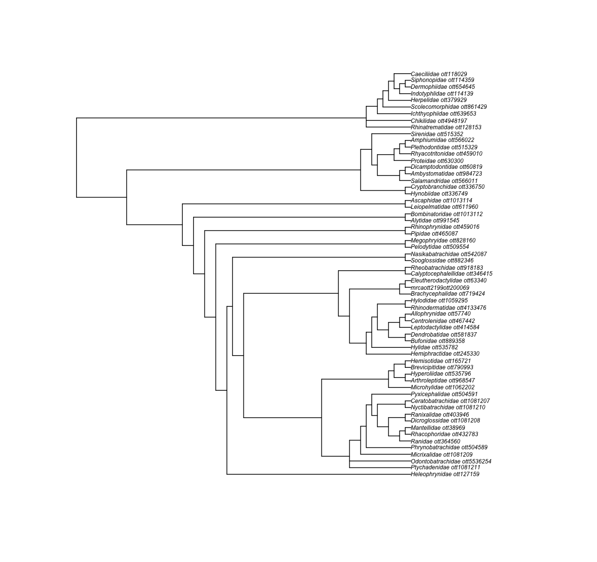

---
# Please do not edit this file directly; it is auto generated.
# Instead, please edit 04-subtree-rank.md in _episodes_rmd/
source: Rmd
title: "4. Getting an induced subtree of all taxa within a taxonomic rank"
teaching: 5
exercises: 5
questions:
- "How do I get all taxa from a certain rank?"
objectives:
- "Get an induced subtree from all taxa of a certain taxonomic rank."
keypoints:
- "It is possible to get all types of subsets from the synthetic tree, as long as you can get the OTT ids!"
---

 
 

There is not a specific function in the [aclage `rotl` that gets all taxa from a given taxonomic rank.
We will now shift to the `datelife` package and use the `get_ott_children()` function, that extracts OTT ids of all taxa from a rank specified by the argument `ott_rank`.

Let's get all amphibian families.

~~~
amphibia_families <- datelife::get_ott_children(ott_ids = resolved_names["Amphibia",]$ott_id, ott_rank = "family")
~~~
{: .language-r}

~~~
ott_ids is not a numeric vector; coercing to numeric.
~~~
{: .output}

~~~
str(amphibia_families)
~~~
{: .language-r}
Now, get the induced subtree using the amphibian families' OTT ids.

~~~
amphibia_families_subtree <- rotl::tol_induced_subtree(amphibia_families$Amphibia$ott_id)
amphibia_families_subtree
~~~
{: .language-r}

Let's print the output.

~~~
ape::plot.phylo(amphibia_families_subtree, cex = 1.2)
~~~
{: .language-r}

 

Super cool!

 

> ## Hands on! Get a family subtree without ott ids in the tip labels
>
> Hint: Look at the arguments of function `tol_induced_subtree()`
>
> > ## Solution
> >
> > 
> > ~~~
> > amphibia_families_subtree2 <- rotl::tol_induced_subtree(amphibia_families$Amphibia$ott_id, label_format = "name")
> > ~~~
> > {: .language-r}
> > 
> > 
> > 
> > ~~~
> > Warning in collapse_singles(tr, show_progress): Dropping singleton nodes with
> > labels: mrcaott114ott391676, mrcaott15857ott152667, mrcaott270630ott3618180,
> > mrcaott22583ott100573, mrcaott22583ott44382, mrcaott44382ott72638,
> > mrcaott44382ott100564, mrcaott65695ott254163, mrcaott65695ott121259,
> > mrcaott2199ott411156, mrcaott7464ott21502, mrcaott21502ott918196, Pelobatoidea,
> > mrcaott18818ott47772, Sirenoidea
> > ~~~
> > {: .warning}
> > 
> > 
> > 
> > ~~~
> > ape::plot.phylo(amphibia_families_subtree2, cex = 1.2)
> > ~~~
> > {: .language-r}
> > 
> > 
> {: .solution}
{: .challenge}

 

We have seen up to now how to get a portion of the synthetic OTOL. How do I inspect the source phylogenetic trees that support the subtrees?

 

> > ## Pro Tip 4.1: Get all taxa from a taxonomic rank.
> >
> > While `datelife` facilitates this task, there are other ways to all taxa from a taxonmic rank using `rotl` functions only. Try it out!
> >
> >
> > 
> > ~~~
> > amphibia_taxonomy <- rotl::taxonomy_subtree(resolved_names["Amphibia",]$ott_id)
> > ~~~
> > {: .language-r}
> > 
> > 
> > 
> > ~~~
> > Error: Only atomic vectors of length 1 or data frames with 1 row can be unboxed.
> > ~~~
> > {: .error}
> > 
> > 
> > 
> > ~~~
> > ls(amphibia_taxonomy)
> > ~~~
> > {: .language-r}
> > 
> > 
> > 
> > ~~~
> > Warning in ls(amphibia_taxonomy): 'amphibia_taxonomy' converted to character
> > string
> > ~~~
> > {: .warning}
> > 
> > 
> > 
> > ~~~
> > Error in as.environment(pos): no item called "amphibia_taxonomy" on the search list
> > ~~~
> > {: .error}
> > 
> > 
> > 
> > ~~~
> > length(amphibia_taxonomy$tip_label)
> > ~~~
> > {: .language-r}
> > 
> > 
> > 
> > ~~~
> > Error in eval(expr, envir, enclos): object 'amphibia_taxonomy' not found
> > ~~~
> > {: .error}
> > 
> > 
> > 
> > ~~~
> > head(amphibia_taxonomy$tip_label)
> > ~~~
> > {: .language-r}
> > 
> > 
> > 
> > ~~~
> > Error in head(amphibia_taxonomy$tip_label): object 'amphibia_taxonomy' not found
> > ~~~
> > {: .error}
> > 
> > 
> > 
> > ~~~
> > tail(amphibia_taxonomy$tip_label)
> > ~~~
> > {: .language-r}
> > 
> > 
> > 
> > ~~~
> > Error in tail(amphibia_taxonomy$tip_label): object 'amphibia_taxonomy' not found
> > ~~~
> > {: .error}
> > 
> > 
> > 
> > ~~~
> > amphibia_taxonomy$edge_label
> > ~~~
> > {: .language-r}
> > 
> > 
> > 
> > ~~~
> > Error in eval(expr, envir, enclos): object 'amphibia_taxonomy' not found
> > ~~~
> > {: .error}
> > 
> > 
> > 
> > ~~~
> > edges <- datelife::extract_ott_ids(x=amphibia_taxonomy$edge_label)
> > ~~~
> > {: .language-r}
> > 
> > 
> > 
> > ~~~
> > Error in datelife::extract_ott_ids(x = amphibia_taxonomy$edge_label): object 'amphibia_taxonomy' not found
> > ~~~
> > {: .error}
> > 
> > 
> > 
> > ~~~
> > length(edges)
> > ~~~
> > {: .language-r}
> > 
> > 
> > 
> > ~~~
> > [1] 1
> > ~~~
> > {: .output}
> > 
> > 
> > 
> > ~~~
> > edges_taxon_info <- rotl::taxonomy_taxon_info(edges)
> > ~~~
> > {: .language-r}
> > 
> > 
> > 
> > ~~~
> > Warning in is.na(ott_ids): is.na() applied to non-(list or vector) of type
> > 'symbol'
> > ~~~
> > {: .warning}
> > 
> > 
> > 
> > ~~~
> > Error in check_ott_ids(ott_id): 'ott_ids' must look like numbers.
> > ~~~
> > {: .error}
> > 
> > 
> > 
> > ~~~
> > ls(edges_taxon_info[[1]])
> > ~~~
> > {: .language-r}
> > 
> > 
> > 
> > ~~~
> > Warning in ls(edges_taxon_info[[1]]): 'edges_taxon_info[[1]]' converted to
> > character string
> > ~~~
> > {: .warning}
> > 
> > 
> > 
> > ~~~
> > Error in as.environment(pos): no item called "edges_taxon_info[[1]]" on the search list
> > ~~~
> > {: .error}
> > 
> > 
> > 
> > ~~~
> > is_family <- unname(unlist(sapply(edges_taxon_info, "[", "rank") %in% "family"))
> > ~~~
> > {: .language-r}
> > 
> > 
> > 
> > ~~~
> > Error in lapply(X = X, FUN = FUN, ...): object 'edges_taxon_info' not found
> > ~~~
> > {: .error}
> > 
> > 
> > 
> > ~~~
> > is_suppressed <- unname(unlist(sapply(edges_taxon_info, "[", "is_suppressed_from_synth")))
> > ~~~
> > {: .language-r}
> > 
> > 
> > 
> > ~~~
> > Error in lapply(X = X, FUN = FUN, ...): object 'edges_taxon_info' not found
> > ~~~
> > {: .error}
> > 
> > 
> > 
> > ~~~
> > # flag "is suppressed from synth" is not updated, so it is useless for now.
> > amphibia_families <- unname(unlist(sapply(edges_taxon_info, "[", "ott_id")[is_family]))
> > ~~~
> > {: .language-r}
> > 
> > 
> > 
> > ~~~
> > Error in lapply(X = X, FUN = FUN, ...): object 'edges_taxon_info' not found
> > ~~~
> > {: .error}
> > 
> > 
> > 
> > ~~~
> > in_tree <- rotl::is_in_tree(amphibia_families)
> > ~~~
> > {: .language-r}
> > 
> > 
> > 
> > ~~~
> > Error in FUN(X[[i]], ...): only 1 element should be provided
> > ~~~
> > {: .error}
> > 
> > 
> > 
> > ~~~
> > amphibia_families_subtree <- rotl::tol_induced_subtree(amphibia_families[in_tree])
> > ~~~
> > {: .language-r}
> > 
> > 
> > 
> > ~~~
> > Error in .tol_induced_subtree(ott_ids = ott_ids, node_ids = node_ids, : object 'in_tree' not found
> > ~~~
> > {: .error}
> {: .solution}
{: .testimonial}

 
