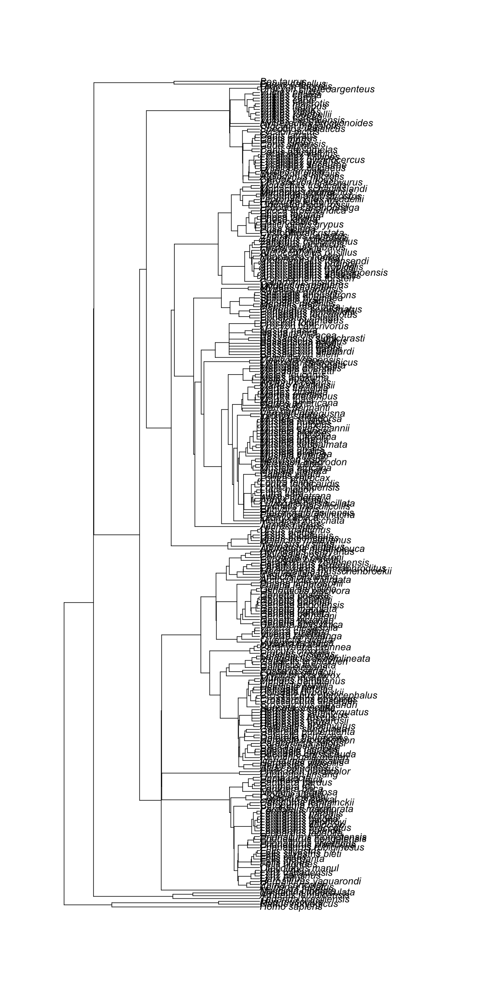
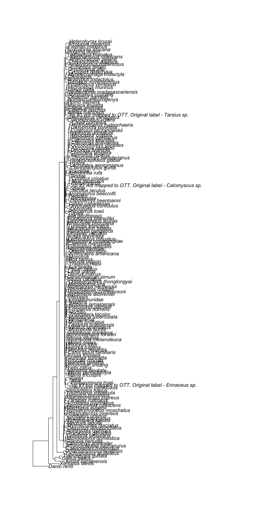
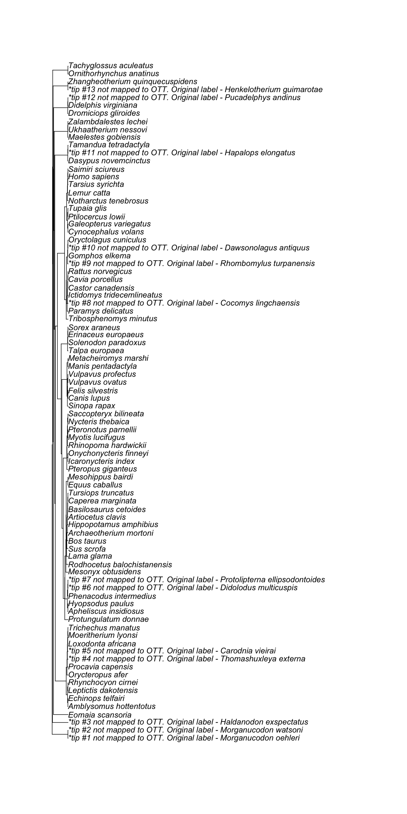
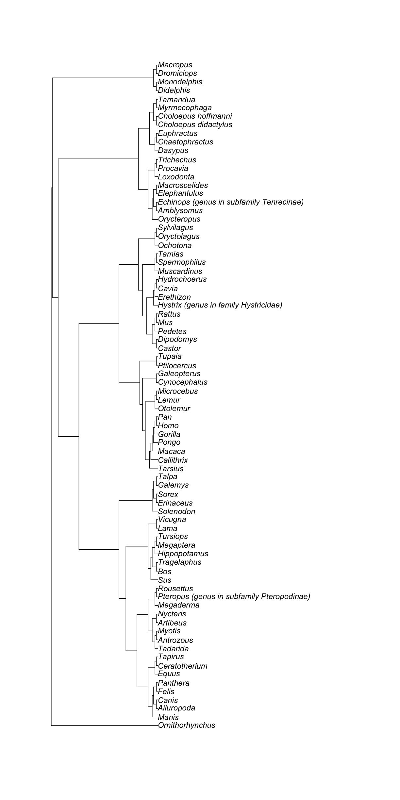

---
# Please do not edit this file directly; it is auto generated.
# Instead, please edit 05-supporting-trees.md in _episodes_rmd/
source: Rmd
title: "Getting studies and trees supporting relationships in a synthetic subtree"
teaching: 5
exercises: 5
questions:
- "What are the original studies supporting relationships in my synthetic subtree?"
objectives:
- "Get supporting trees for certain regions of the synthetic Open Tree of Life."
keypoints:
- "Supporting trees usually contains more taxa than the ones we are interested in."
---

~~~
canis_node_studies <- rotl::source_list(canis_node_info)
canis_node_studies
~~~
{: .language-r}

~~~
                 study_id  tree_id                                  git_sha
ot_278@tree1       ot_278    tree1 3008105691283414a18a6c8a728263b2aa8e7960
ot_328@tree1       ot_328    tree1 3008105691283414a18a6c8a728263b2aa8e7960
pg_1428@tree2855  pg_1428 tree2855 3008105691283414a18a6c8a728263b2aa8e7960
pg_2647@tree6169  pg_2647 tree6169 3008105691283414a18a6c8a728263b2aa8e7960
pg_2812@tree6545  pg_2812 tree6545 3008105691283414a18a6c8a728263b2aa8e7960
~~~
{: .output}
To get the actual trees, we will need the function `get_study_tree()`.
It takes one _study id_ and _tree id_ at a time.

~~~
x <- 1
rotl::get_study_tree(study_id = canis_node_studies$study_id[x], tree_id = canis_node_studies$tree_id[x], tip_label="ott_taxon_name", deduplicate = TRUE)
~~~
{: .language-r}

~~~
Warning: Some tip labels were duplicated and have been modified: Leptocyon,
Leptocyon, Leptocyon, Leptocyon, Leptocyon, Leptocyon, Leptocyon, Canidae,
Canidae, Urocyon, Urocyon, Urocyon, Cerdocyon, Canis, Canis, Canis, Canis,
Canis, Canis, Canis, Canis, Canis, Canidae, Cynarctoides
~~~
{: .error}

~~~

Phylogenetic tree with 142 tips and 141 internal nodes.

Tip labels:
	Prohesperocyon_wilsoni, Ectopocynus_antiquus, Ectopocynus_intermedius, Ectopocynus_simplicidens, Hesperocyon, Hesperocyon_gregarius, ...

Rooted; includes branch lengths.
~~~
{: .output}

> ## **Challenge!** Get all supporting trees.
>
> Call the output `canis_source_trees`
>
> Hint: You can use a "for" loop or an `apply()` function to get them all.
>
> > ## Solution
> >
> > With a "for" loop.
> >
> > 
> > ~~~
> > canis_source_trees <- vector(mode = "list") # generate an empty list
> > for (i in seq(nrow(canis_node_studies))){
> >   source_tree <- rotl::get_study_tree(study_id = canis_node_studies$study_id[i], tree_id = canis_node_studies$tree_id[i], tip_label="ott_taxon_name", deduplicate = TRUE)
> >   canis_source_trees <- c(canis_source_trees, list(source_tree))
> > }
> > ~~~
> > {: .language-r}
> > 
> > 
> > 
> > ~~~
> > Warning: Some tip labels were duplicated and have been modified: Leptocyon,
> > Leptocyon, Leptocyon, Leptocyon, Leptocyon, Leptocyon, Leptocyon, Canidae,
> > Canidae, Urocyon, Urocyon, Urocyon, Cerdocyon, Canis, Canis, Canis, Canis,
> > Canis, Canis, Canis, Canis, Canis, Canidae, Cynarctoides
> > ~~~
> > {: .error}
> > 
> > 
> > 
> > ~~~
> > canis_source_trees
> > ~~~
> > {: .language-r}
> > 
> > 
> > 
> > ~~~
> > [[1]]
> > 
> > Phylogenetic tree with 142 tips and 141 internal nodes.
> > 
> > Tip labels:
> > 	Prohesperocyon_wilsoni, Ectopocynus_antiquus, Ectopocynus_intermedius, Ectopocynus_simplicidens, Hesperocyon, Hesperocyon_gregarius, ...
> > 
> > Rooted; includes branch lengths.
> > 
> > [[2]]
> > 
> > Phylogenetic tree with 294 tips and 272 internal nodes.
> > 
> > Tip labels:
> > 	Homo_sapiens, Rattus_norvegicus, Mus_musculus, Artibeus_jamaicensis, Mystacina_tuberculata, Tadarida_brasiliensis, ...
> > 
> > Rooted; includes branch lengths.
> > 
> > [[3]]
> > 
> > Phylogenetic tree with 169 tips and 168 internal nodes.
> > 
> > Tip labels:
> > 	Xenopus_laevis, Anolis_carolinensis, Gallus_gallus, Taeniopygia_guttata, Tachyglossus_aculeatus, Ornithorhynchus_anatinus, ...
> > 
> > Rooted; includes branch lengths.
> > 
> > [[4]]
> > 
> > Phylogenetic tree with 86 tips and 85 internal nodes.
> > 
> > Tip labels:
> > 	*tip_#1_not_mapped_to_OTT._Original_label_-_Morganucodon_oehleri, *tip_#2_not_mapped_to_OTT._Original_label_-_Morganucodon_watsoni, *tip_#3_not_mapped_to_OTT._Original_label_-_Haldanodon_exspectatus, Eomaia_scansoria, Amblysomus_hottentotus, Echinops_telfairi, ...
> > 
> > Rooted; no branch lengths.
> > 
> > [[5]]
> > 
> > Phylogenetic tree with 78 tips and 77 internal nodes.
> > 
> > Tip labels:
> > 	Ornithorhynchus, Manis, Ailuropoda, Canis, Felis, Panthera, ...
> > 
> > Rooted; no branch lengths.
> > ~~~
> > {: .output}
> >
> > With an `apply()` function.
> >
> > 
> > ~~~
> > canis_source_trees <- sapply(seq(nrow(canis_node_studies)), function(i)
> >   rotl::get_study_tree(study_id = canis_node_studies$study_id[i], tree_id = canis_node_studies$tree_id[i], tip_label="ott_taxon_name", deduplicate = TRUE))
> > ~~~
> > {: .language-r}
> > 
> > 
> > 
> > ~~~
> > Warning: Some tip labels were duplicated and have been modified: Leptocyon,
> > Leptocyon, Leptocyon, Leptocyon, Leptocyon, Leptocyon, Leptocyon, Canidae,
> > Canidae, Urocyon, Urocyon, Urocyon, Cerdocyon, Canis, Canis, Canis, Canis,
> > Canis, Canis, Canis, Canis, Canis, Canidae, Cynarctoides
> > ~~~
> > {: .error}
> > 
> > 
> > 
> > ~~~
> > canis_source_trees
> > ~~~
> > {: .language-r}
> > 
> > 
> > 
> > ~~~
> > [[1]]
> > 
> > Phylogenetic tree with 142 tips and 141 internal nodes.
> > 
> > Tip labels:
> > 	Prohesperocyon_wilsoni, Ectopocynus_antiquus, Ectopocynus_intermedius, Ectopocynus_simplicidens, Hesperocyon, Hesperocyon_gregarius, ...
> > 
> > Rooted; includes branch lengths.
> > 
> > [[2]]
> > 
> > Phylogenetic tree with 294 tips and 272 internal nodes.
> > 
> > Tip labels:
> > 	Homo_sapiens, Rattus_norvegicus, Mus_musculus, Artibeus_jamaicensis, Mystacina_tuberculata, Tadarida_brasiliensis, ...
> > 
> > Rooted; includes branch lengths.
> > 
> > [[3]]
> > 
> > Phylogenetic tree with 169 tips and 168 internal nodes.
> > 
> > Tip labels:
> > 	Xenopus_laevis, Anolis_carolinensis, Gallus_gallus, Taeniopygia_guttata, Tachyglossus_aculeatus, Ornithorhynchus_anatinus, ...
> > 
> > Rooted; includes branch lengths.
> > 
> > [[4]]
> > 
> > Phylogenetic tree with 86 tips and 85 internal nodes.
> > 
> > Tip labels:
> > 	*tip_#1_not_mapped_to_OTT._Original_label_-_Morganucodon_oehleri, *tip_#2_not_mapped_to_OTT._Original_label_-_Morganucodon_watsoni, *tip_#3_not_mapped_to_OTT._Original_label_-_Haldanodon_exspectatus, Eomaia_scansoria, Amblysomus_hottentotus, Echinops_telfairi, ...
> > 
> > Rooted; no branch lengths.
> > 
> > [[5]]
> > 
> > Phylogenetic tree with 78 tips and 77 internal nodes.
> > 
> > Tip labels:
> > 	Ornithorhynchus, Manis, Ailuropoda, Canis, Felis, Panthera, ...
> > 
> > Rooted; no branch lengths.
> > ~~~
> > {: .output}
> {: .solution}
{: .challenge}

Let's plot the supporting trees.

~~~
for (i in seq(length(canis_source_trees))){
  ape::plot.phylo(canis_source_trees[[i]])
}
~~~
{: .language-r}

Note that supporting trees for a node can be larger than the subtree itself.

You will have to drop the unwanted taxa from the supporting studies if you just want the parts that belong to the subtree.

Also, tip labels have different names, so we have to standardize them with tnrs before trying to subset.
