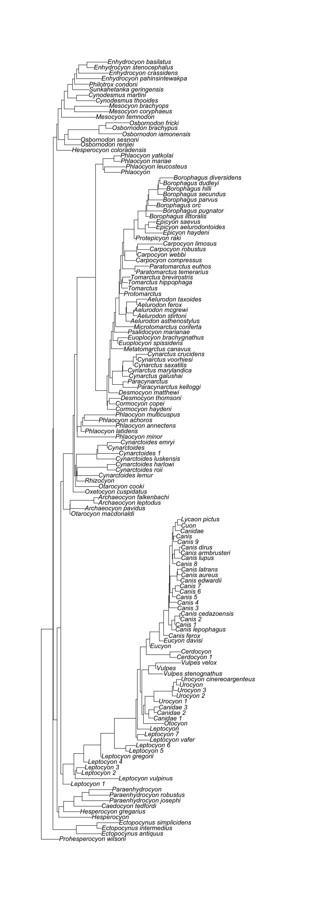
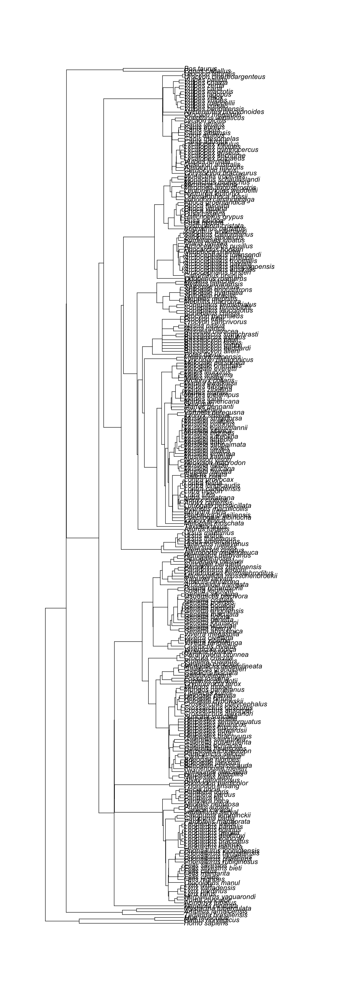
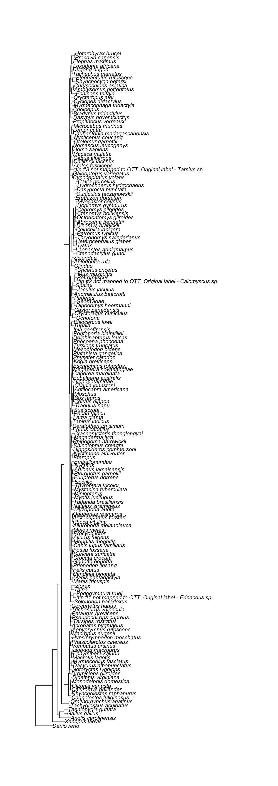
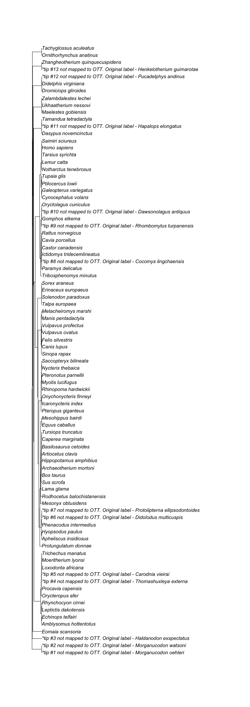
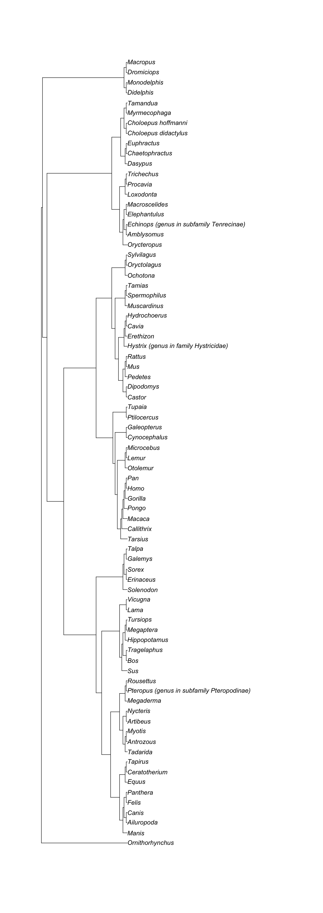

---
# Please do not edit this file directly; it is auto generated.
# Instead, please edit 05-supporting-trees.md in _episodes_rmd/
source: Rmd
title: "5. Getting studies and trees supporting relationships in a synthetic subtree"
teaching: 5
exercises: 5
questions:
- "What are the original studies supporting relationships in my synthetic subtree?"
objectives:
- "Get supporting trees for certain regions of the synthetic Open Tree of Life."
keypoints:
- "Supporting trees usually contain more taxa than the ones we are interested in."
---

 
 

To get the source trees supporting a node from our synthetic tree we will need two functions.
The function `source_list`() gets the study and tree ids (and other info) from source studies (not the trees). It is applied to a 'tol_node' object.

We already have one that we generated with `tol_node_info()`, do you remember how we called it?

> ## Hands on! Get all supporting trees.
> Get the supporting study metadata from the _Canis_ node info. Store it in an object called `canis_node_studies`.
> Look at its class and the information it contains.
>
> 
> ~~~
> canis_node_studies <- rotl::source_list(canis_node_info)
> ~~~
> {: .language-r}
>
> 
> ~~~
> class(canis_node_studies)
> ~~~
> {: .language-r}
> 
> 
> 
> ~~~
> [1] "data.frame"
> ~~~
> {: .output}
>
> 
> ~~~
> str(canis_node_studies)
> ~~~
> {: .language-r}
> 
> 
> 
> ~~~
> 'data.frame':	5 obs. of  3 variables:
>  $ study_id: chr  "ot_278" "ot_328" "pg_1428" "pg_2647" ...
>  $ tree_id : chr  "tree1" "tree1" "tree2855" "tree6169" ...
>  $ git_sha : chr  "" "" "" "" ...
> ~~~
> {: .output}
>
{: .challenge}

Now that we have the ids, we can use the function `get_study_tree()`, which will get us the actual supporting trees.
This function takes one _study id_ and _tree id_ at a time, like this:

~~~
x <- 1
rotl::get_study_tree(study_id = canis_node_studies$study_id[x], tree_id = canis_node_studies$tree_id[x], tip_label="ott_taxon_name", deduplicate = TRUE)
~~~
{: .language-r}

~~~
Warning: Some tip labels were duplicated and have been modified: Leptocyon,
Leptocyon, Leptocyon, Leptocyon, Leptocyon, Leptocyon, Leptocyon, Canidae,
Canidae, Urocyon, Urocyon, Urocyon, Cerdocyon, Canis, Canis, Canis, Canis,
Canis, Canis, Canis, Canis, Canis, Canidae, Cynarctoides
~~~
{: .warning}

~~~

Phylogenetic tree with 142 tips and 141 internal nodes.

Tip labels:
  Prohesperocyon_wilsoni, Ectopocynus_antiquus, Ectopocynus_intermedius, Ectopocynus_simplicidens, Hesperocyon, Hesperocyon_gregarius, ...

Rooted; includes branch lengths.
~~~
{: .output}

> ## Hands on! Get all supporting trees.
>
> Call the output _canis_source_trees_
>
> Hint: You can use a **"for" loop** or an `apply()` function to get them all.
>
> > ## Solution
> >
> > With a 'for' loop.
> >
> > 
> > ~~~
> > canis_source_trees <- vector(mode = "list") # generate an empty list
> > for (i in seq(nrow(canis_node_studies))){
> >   source_tree <- rotl::get_study_tree(study_id = canis_node_studies$study_id[i], tree_id = canis_node_studies$tree_id[i], tip_label="ott_taxon_name", deduplicate = TRUE)
> >   canis_source_trees <- c(canis_source_trees, list(source_tree))
> > }
> > ~~~
> > {: .language-r}
> > 
> > 
> > 
> > ~~~
> > Warning: Some tip labels were duplicated and have been modified: Leptocyon,
> > Leptocyon, Leptocyon, Leptocyon, Leptocyon, Leptocyon, Leptocyon, Canidae,
> > Canidae, Urocyon, Urocyon, Urocyon, Cerdocyon, Canis, Canis, Canis, Canis,
> > Canis, Canis, Canis, Canis, Canis, Canidae, Cynarctoides
> > ~~~
> > {: .warning}
> > 
> > 
> > 
> > ~~~
> > canis_source_trees
> > ~~~
> > {: .language-r}
> > 
> > 
> > 
> > ~~~
> > [[1]]
> > 
> > Phylogenetic tree with 142 tips and 141 internal nodes.
> > 
> > Tip labels:
> >   Prohesperocyon_wilsoni, Ectopocynus_antiquus, Ectopocynus_intermedius, Ectopocynus_simplicidens, Hesperocyon, Hesperocyon_gregarius, ...
> > 
> > Rooted; includes branch lengths.
> > 
> > [[2]]
> > 
> > Phylogenetic tree with 294 tips and 272 internal nodes.
> > 
> > Tip labels:
> >   Homo_sapiens, Rattus_norvegicus, Mus_musculus, Artibeus_jamaicensis, Mystacina_tuberculata, Tadarida_brasiliensis, ...
> > 
> > Rooted; includes branch lengths.
> > 
> > [[3]]
> > 
> > Phylogenetic tree with 169 tips and 168 internal nodes.
> > 
> > Tip labels:
> >   Xenopus_laevis, Anolis_carolinensis, Gallus_gallus, Taeniopygia_guttata, Tachyglossus_aculeatus, Ornithorhynchus_anatinus, ...
> > 
> > Rooted; includes branch lengths.
> > 
> > [[4]]
> > 
> > Phylogenetic tree with 86 tips and 85 internal nodes.
> > 
> > Tip labels:
> >   *tip_#1_not_mapped_to_OTT._Original_label_-_Morganucodon_oehleri, *tip_#2_not_mapped_to_OTT._Original_label_-_Morganucodon_watsoni, *tip_#3_not_mapped_to_OTT._Original_label_-_Haldanodon_exspectatus, Eomaia_scansoria, Amblysomus_hottentotus, Echinops_telfairi, ...
> > 
> > Rooted; no branch lengths.
> > 
> > [[5]]
> > 
> > Phylogenetic tree with 78 tips and 77 internal nodes.
> > 
> > Tip labels:
> >   Ornithorhynchus, Manis, Ailuropoda, Canis, Felis, Panthera, ...
> > 
> > Rooted; no branch lengths.
> > ~~~
> > {: .output}
> >
> > With an `apply()` function.
> >
> > 
> > ~~~
> > canis_source_trees <- sapply(seq(nrow(canis_node_studies)), function(i)
> >   rotl::get_study_tree(study_id = canis_node_studies$study_id[i], tree_id = canis_node_studies$tree_id[i], tip_label="ott_taxon_name", deduplicate = TRUE))
> > ~~~
> > {: .language-r}
> > 
> > 
> > 
> > ~~~
> > Warning: Some tip labels were duplicated and have been modified: Leptocyon,
> > Leptocyon, Leptocyon, Leptocyon, Leptocyon, Leptocyon, Leptocyon, Canidae,
> > Canidae, Urocyon, Urocyon, Urocyon, Cerdocyon, Canis, Canis, Canis, Canis,
> > Canis, Canis, Canis, Canis, Canis, Canidae, Cynarctoides
> > ~~~
> > {: .warning}
> > 
> > 
> > 
> > ~~~
> > canis_source_trees
> > ~~~
> > {: .language-r}
> > 
> > 
> > 
> > ~~~
> > [[1]]
> > 
> > Phylogenetic tree with 142 tips and 141 internal nodes.
> > 
> > Tip labels:
> >   Prohesperocyon_wilsoni, Ectopocynus_antiquus, Ectopocynus_intermedius, Ectopocynus_simplicidens, Hesperocyon, Hesperocyon_gregarius, ...
> > 
> > Rooted; includes branch lengths.
> > 
> > [[2]]
> > 
> > Phylogenetic tree with 294 tips and 272 internal nodes.
> > 
> > Tip labels:
> >   Homo_sapiens, Rattus_norvegicus, Mus_musculus, Artibeus_jamaicensis, Mystacina_tuberculata, Tadarida_brasiliensis, ...
> > 
> > Rooted; includes branch lengths.
> > 
> > [[3]]
> > 
> > Phylogenetic tree with 169 tips and 168 internal nodes.
> > 
> > Tip labels:
> >   Xenopus_laevis, Anolis_carolinensis, Gallus_gallus, Taeniopygia_guttata, Tachyglossus_aculeatus, Ornithorhynchus_anatinus, ...
> > 
> > Rooted; includes branch lengths.
> > 
> > [[4]]
> > 
> > Phylogenetic tree with 86 tips and 85 internal nodes.
> > 
> > Tip labels:
> >   *tip_#1_not_mapped_to_OTT._Original_label_-_Morganucodon_oehleri, *tip_#2_not_mapped_to_OTT._Original_label_-_Morganucodon_watsoni, *tip_#3_not_mapped_to_OTT._Original_label_-_Haldanodon_exspectatus, Eomaia_scansoria, Amblysomus_hottentotus, Echinops_telfairi, ...
> > 
> > Rooted; no branch lengths.
> > 
> > [[5]]
> > 
> > Phylogenetic tree with 78 tips and 77 internal nodes.
> > 
> > Tip labels:
> >   Ornithorhynchus, Manis, Ailuropoda, Canis, Felis, Panthera, ...
> > 
> > Rooted; no branch lengths.
> > ~~~
> > {: .output}
> {: .solution}
{: .challenge}

The object `canis_node_studies` contains a lot of information. You can get it using a 'for' loop, or an `apply()` function.

A key piece of information are the citations from the supporting studies. We can get these for each source trees with the function `get_study_meta()`. Let's do it. First we need the study meta:

~~~
canis_node_studies_meta <- lapply(seq(nrow(canis_node_studies)), function(i)
  rotl::get_study_meta(study_id = canis_node_studies$study_id[i]))
~~~
{: .language-r}

Now we can get the citations:

~~~
canis_node_studies_citations <- sapply(seq(length(canis_node_studies_meta)), function (i) canis_node_studies_meta[[i]]$nexml$`^ot:studyPublicationReference`)
~~~
{: .language-r}

Finally, let's plot the supporting trees along with their citations.

~~~
for (i in seq(length(canis_source_trees))){
  print(paste("The supporting tree below has", length(canis_source_trees[[i]]$tip.label), "tips."))
  print(paste("Citation is:", canis_node_studies_citations[i]))
  ape::plot.phylo(canis_source_trees[[i]])
}
~~~
{: .language-r}

~~~
[1] "The supporting tree below has 142 tips."
[1] "Citation is: Tedford, Richard H.; Wang, Xiaoming; Taylor, Beryl E. (2009). Phylogenetic systematics of the North American fossil Caninae (Carnivora, Canidae). Bulletin of the American Museum of Natural History, no. 325. http://hdl.handle.net/2246/5999\n\nWang, Xiaoming; Tedford, Richard H.; Taylor, Beryl E. (1999). Phylogenetic systematics of the Borophaginae (Carnivora, Canidae). Bulletin of the American Museum of Natural History, no. 243. http://hdl.handle.net/2246/1588\n\nWang, Xiaoming (1994). Phylogenetic systematics of the Hesperocyoninae (Carnivora, Canidae). Bulletin of the  American Museum of Natural History, no. 221. http://hdl.handle.net/2246/829\n"
~~~
{: .output}

~~~
[1] "The supporting tree below has 294 tips."
[1] "Citation is: Nyakatura, Katrin, Olaf RP Bininda-Emonds. 2012. Updating the evolutionary history of Carnivora (Mammalia): a new species-level supertree complete with divergence time estimates. BMC Biology 10 (1): 12"
~~~
{: .output}

~~~
[1] "The supporting tree below has 169 tips."
[1] "Citation is: Meredith, R.W., Janecka J., Gatesy J., Ryder O.A., Fisher C., Teeling E., Goodbla A., Eizirik E., Simao T., Stadler T., Rabosky D., Honeycutt R., Flynn J., Ingram C., Steiner C., Williams T., Robinson T., Herrick A., Westerman M., Ayoub N., Springer M., & Murphy W. 2011. Impacts of the Cretaceous Terrestrial Revolution and KPg Extinction on Mammal Diversification. Science 334 (6055): 521-524."
~~~
{: .output}

~~~
[1] "The supporting tree below has 86 tips."
[1] "Citation is: O'Leary, M. A., J. I. Bloch, J. J. Flynn, T. J. Gaudin, A. Giallombardo, N. P. Giannini, S. L. Goldberg, B. P. Kraatz, Z.-X. Luo, J. Meng, X. Ni, M. J. Novacek, F. A. Perini, Z. S. Randall, G. W. Rougier, E. J. Sargis, M. T. Silcox, N. B. Simmons, M. Spaulding, P. M. Velazco, M. Weksler, J. R. Wible, A. L. Cirranello. 2013. The placental mammal ancestor and the post-K-Pg radiation of placentals. Science 339 (6120): 662-667."
~~~
{: .output}

~~~
[1] "The supporting tree below has 78 tips."
[1] "Citation is: Lartillot, Nicolas, Frédéric Delsuc. 2012. Joint reconstruction of divergence times and life-history evolution in placental mammals using a phylogenetic covariance model. Evolution 66 (6): 1773-1787."
~~~
{: .output}

 

Note that the supporting trees for a node can be larger than the subtree itself.

You will have to drop the unwanted taxa from the supporting studies if you just want the parts that belong to the subtree.

Moreover, the tip labels have different taxon names in the source trees and the synthetic subtrees. I you go to the browser, you can access original tips and matched tips, but R drops that info. We would have to standardize them with TNRS before trying to subset, and that takes some time and often visual inspection.

 
