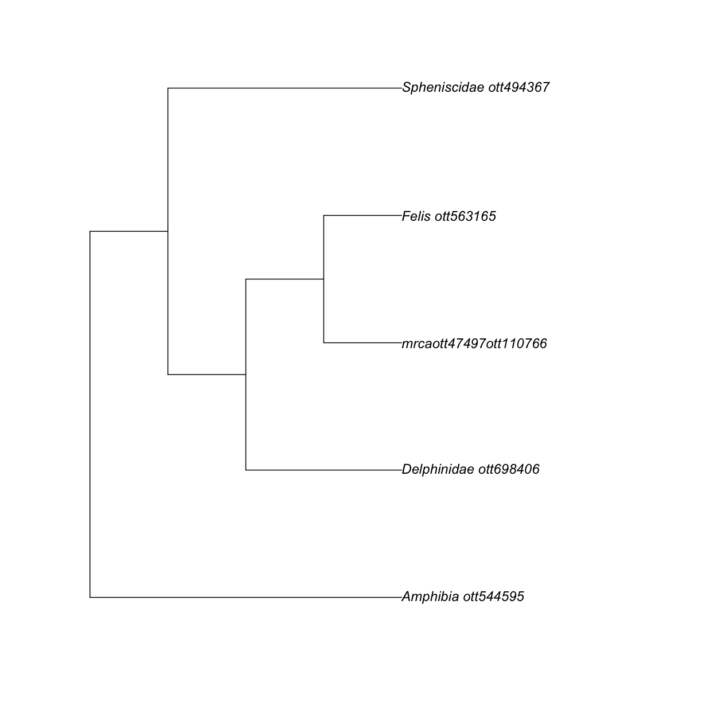

---
# Please do not edit this file directly; it is auto generated.
# Instead, please edit 06-age-summary.md in _episodes_rmd/
source: Rmd
title: "Summarizing branch length information"
teaching: 5
exercises: 5
questions:
- "How do I do this?"
objectives:
- "Understand problems with phylogenetic uncertainty and ages"
keypoints:
- "..."
---

We can summarize it.

~~~
apes_phylo_median <-  datelife::summarize_datelife_result(apes_dr,summary_format = "phylo_median")
~~~
{: .language-r}

~~~
apes_phylo_median
~~~
{: .language-r}

Phylogenetic tree with 8 tips and 7 internal nodes.

Tip labels:
	Homo_sapiens, Pan_paniscus, Gorilla_beringei, Gorilla_gorilla, Pongo_abelii, Pongo_pygmaeus, ...
Node labels:
	n1, n2, n3, n4, n5, n6, ...

Rooted; includes branch lengths.

~~~
ape::plot.phylo(apes_phylo_median, cex = 1)
ape::axisPhylo()
~~~
{: .language-r}

