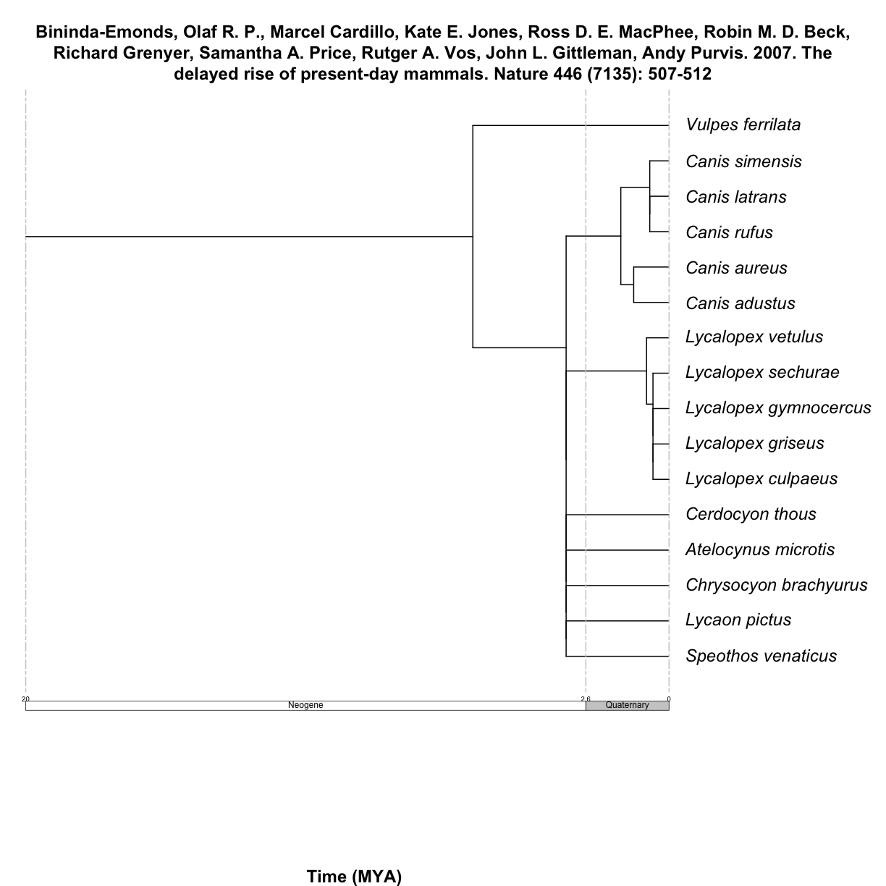
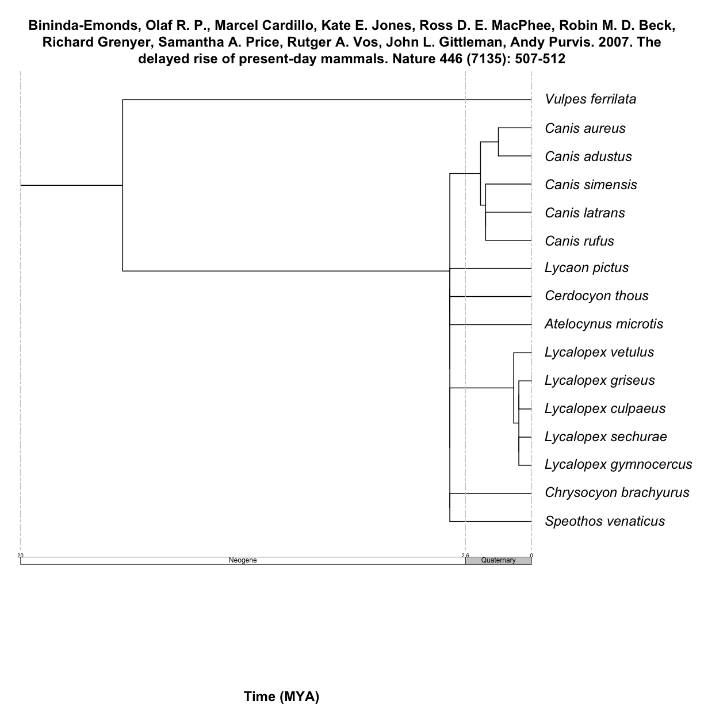
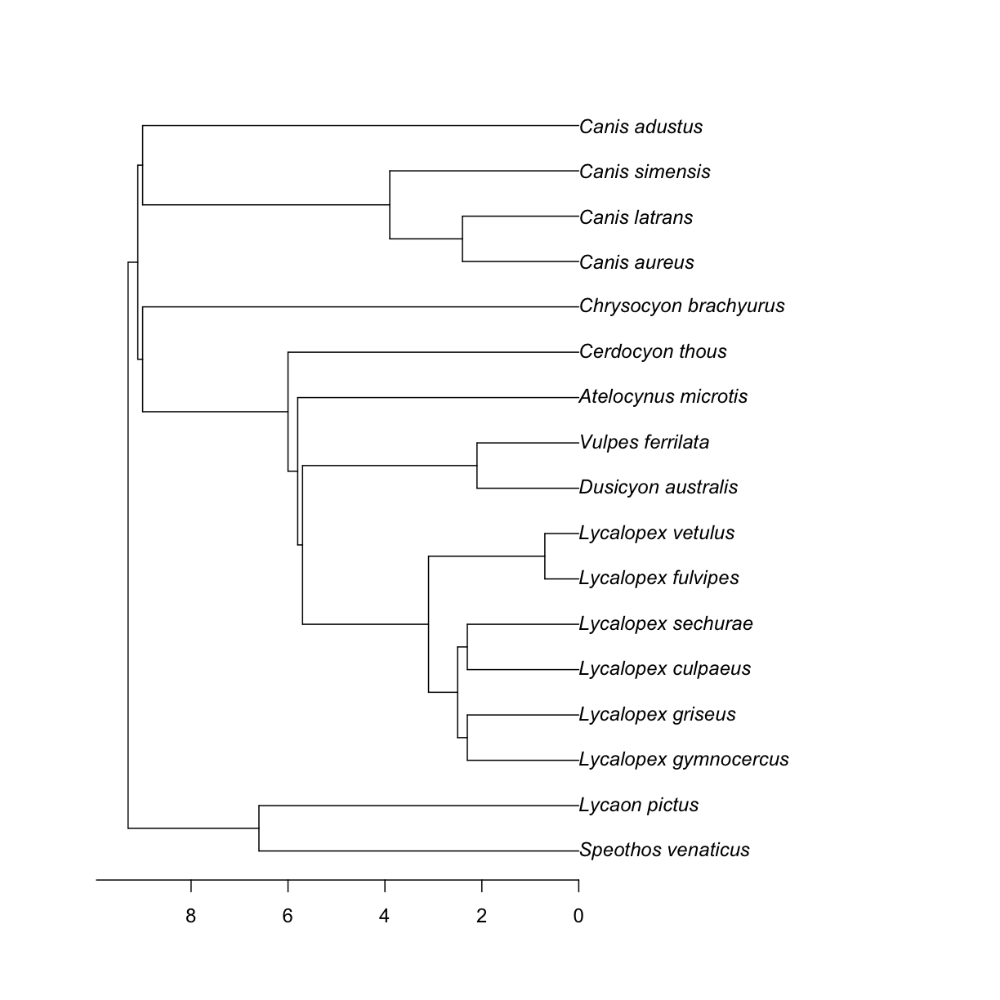
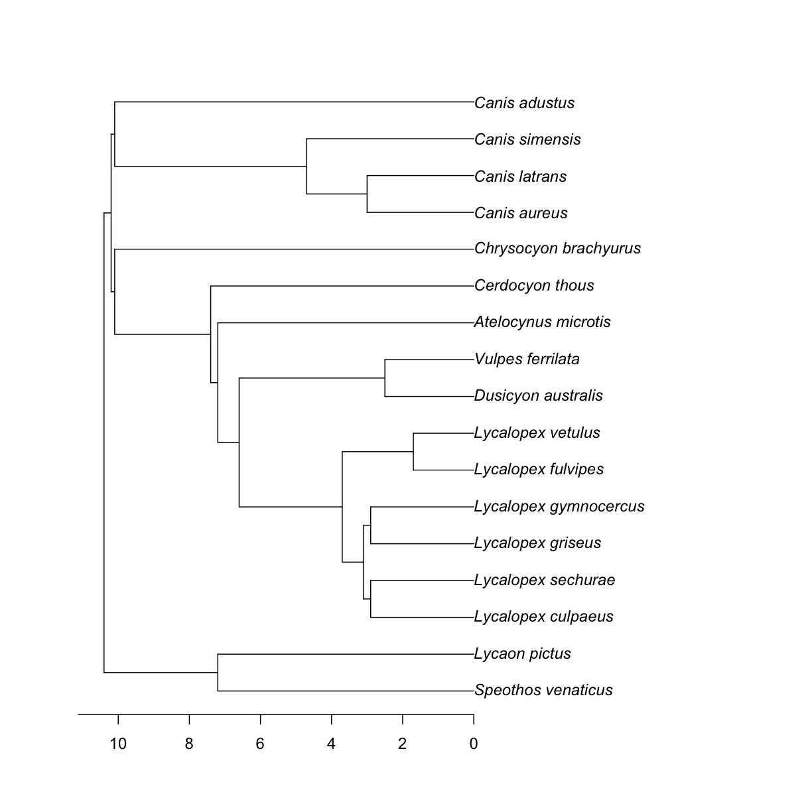
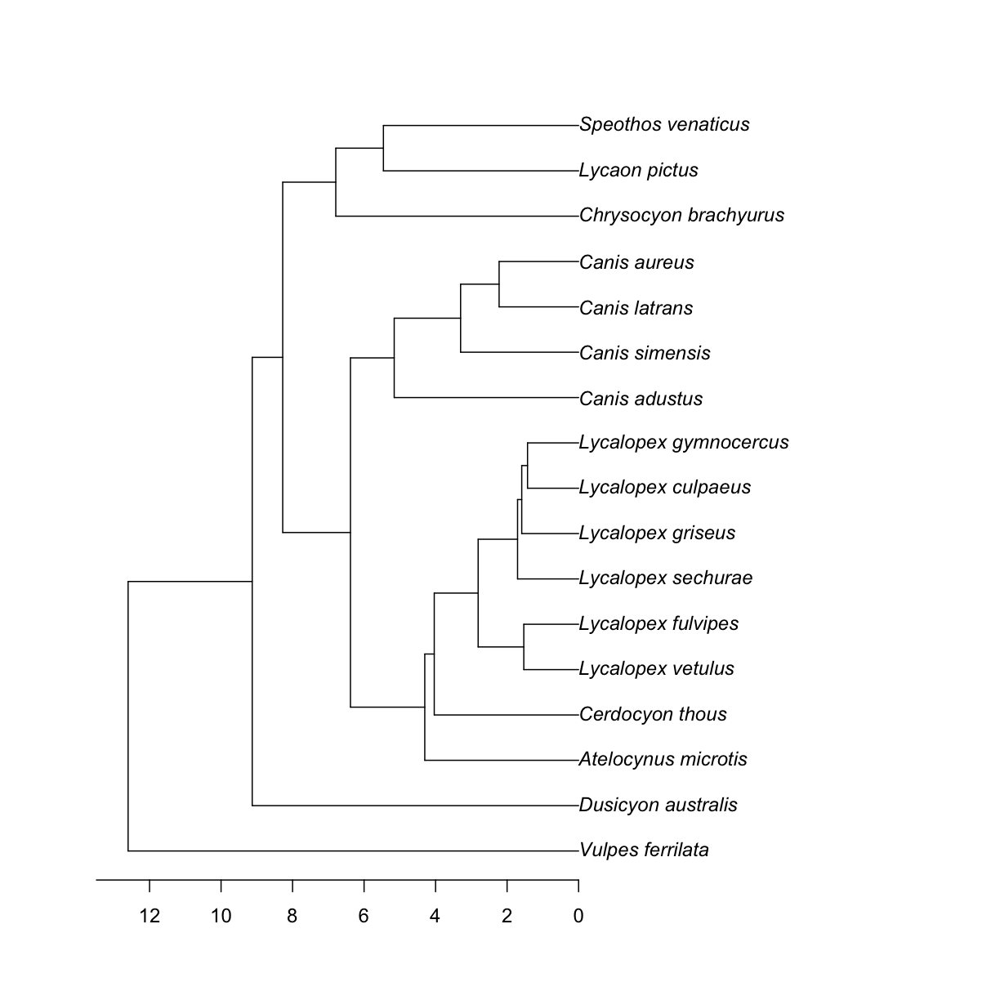

---
# Please do not edit this file directly; it is auto generated.
# Instead, please edit 06-branch-lengths.md in _episodes_rmd/
source: Rmd
title: "Getting branch length information (proportional to time) for you taxa"
teaching: 5
exercises: 5
questions:
- "How do I find supporting trees that include branch lengths?"
- "How do I subset them to include just the taxa I am interested in?"
objectives:
- "Learn about the opentree_chronograms object from datelife"
- "Get source chronograms from the opentree_chronograms object for a set of taxa"
keypoints:
- "datelife stored chronograms from source trees from the Open Tree of Life phylesystem"
- "chronograms are stored in the opentree-chronograms object"
- "source chronograms are retrieved at the species level only (for now)"
---

### Subset a list of studies or trees by some criteria

We can get a list of study and tree properties available with the function `studies_properties()`.
The values that this properties can take are listed in the [phylesystem API wiki](https://github.com/OpenTreeOfLife/phylesystem-api/wiki/NexSON).

To get get all trees with branch lengths poprotional to time, we use the function
`studies_find_trees()`, with the property "ot:branchLengthMode" and the value "ot:time".
It takes some time for it to get all the information.

> ## Extra! Try it yourself.
>
> 
> ~~~
> chronograms <- rotl::studies_find_trees(property = "ot:branchLengthMode", value = "ot:time", verbose = TRUE, detailed = TRUE)
> ~~~
> {: .language-r}
> 
> ~~~
> class(chronograms)
> names(chronograms)
> ~~~
> {: .language-r}
> We should be able to use `list_trees()` to get all trees matching our criteria.
> 
> ~~~
> rotl:::list_trees(chronograms)
> ~~~
> {: .language-r}
>
> Except, it does not really work.
{: .testimonial}

In the package `datelife`, we have implemented a workflow that extracts all studies containing information from at least two taxa.

You can get all source chronograms from an induced subtree, as long as the tip labels
are in the "name" format (and not the default "name_and_id").

~~~
canis_node_subtree <- rotl::tol_subtree(node_id = canis_node_info$node_id, label = "name")
canis_node_subtree
~~~
{: .language-r}

~~~

Phylogenetic tree with 85 tips and 28 internal nodes.

Tip labels:
	Canis_lupus_pallipes, Canis_lupus_chanco, Canis_lupus_baileyi, Canis_lupus_laniger, Canis_lupus_hattai, Canis_lupus_desertorum, ...
Node labels:
	, , , , , , ...

Unrooted; no branch lengths.
~~~
{: .output}

Use that tree as input for the `get_datelife_result()`.

~~~
canis_dr <- datelife::get_datelife_result(canis_node_subtree)
~~~
{: .language-r}
We have now a list of matrices storing time of lineage divergence data for all taxon pairs.

Lists are named by the study citation, so we have that information handy at all times.

Let's explore the output.

~~~
names(canis_dr)
~~~
{: .language-r}

~~~
[1] "Bininda-Emonds, Olaf R. P., Marcel Cardillo, Kate E. Jones, Ross D. E. MacPhee, Robin M. D. Beck, Richard Grenyer, Samantha A. Price, Rutger A. Vos, John L. Gittleman, Andy Purvis. 2007. The delayed rise of present-day mammals. Nature 446 (7135): 507-512"
[2] "Bininda-Emonds, Olaf R. P., Marcel Cardillo, Kate E. Jones, Ross D. E. MacPhee, Robin M. D. Beck, Richard Grenyer, Samantha A. Price, Rutger A. Vos, John L. Gittleman, Andy Purvis. 2007. The delayed rise of present-day mammals. Nature 446 (7135): 507-512"
[3] "Bininda-Emonds, Olaf R. P., Marcel Cardillo, Kate E. Jones, Ross D. E. MacPhee, Robin M. D. Beck, Richard Grenyer, Samantha A. Price, Rutger A. Vos, John L. Gittleman, Andy Purvis. 2007. The delayed rise of present-day mammals. Nature 446 (7135): 507-512"
[4] "Nyakatura, Katrin, Olaf RP Bininda-Emonds. 2012. Updating the evolutionary history of Carnivora (Mammalia): a new species-level supertree complete with divergence time estimates. BMC Biology 10 (1): 12"                                                     
[5] "Nyakatura, Katrin, Olaf RP Bininda-Emonds. 2012. Updating the evolutionary history of Carnivora (Mammalia): a new species-level supertree complete with divergence time estimates. BMC Biology 10 (1): 12"                                                     
[6] "Nyakatura, Katrin, Olaf RP Bininda-Emonds. 2012. Updating the evolutionary history of Carnivora (Mammalia): a new species-level supertree complete with divergence time estimates. BMC Biology 10 (1): 12"                                                     
[7] "Hedges, S. Blair, Julie Marin, Michael Suleski, Madeline Paymer, Sudhir Kumar. 2015. Tree of life reveals clock-like speciation and diversification. Molecular Biology and Evolution 32 (4): 835-845"                                                          
~~~
{: .output}

~~~
canis_dr[1] # look at the first element of the list
~~~
{: .language-r}

~~~
$`Bininda-Emonds, Olaf R. P., Marcel Cardillo, Kate E. Jones, Ross D. E. MacPhee, Robin M. D. Beck, Richard Grenyer, Samantha A. Price, Rutger A. Vos, John L. Gittleman, Andy Purvis. 2007. The delayed rise of present-day mammals. Nature 446 (7135): 507-512`
                      Canis rufus Canis latrans Canis simensis Canis adustus
Canis rufus                   0.0           2.8            2.8           3.2
Canis latrans                 2.8           0.0            2.8           3.2
Canis simensis                2.8           2.8            0.0           3.2
Canis adustus                 3.2           3.2            3.2           0.0
Canis aureus                  3.2           3.2            3.2           2.6
Lycalopex culpaeus            6.4           6.4            6.4           6.4
Lycalopex griseus             6.4           6.4            6.4           6.4
Lycalopex gymnocercus         6.4           6.4            6.4           6.4
Lycalopex sechurae            6.4           6.4            6.4           6.4
Lycalopex vetulus             6.4           6.4            6.4           6.4
Atelocynus microtis           6.4           6.4            6.4           6.4
Cerdocyon thous               6.4           6.4            6.4           6.4
Chrysocyon brachyurus         6.4           6.4            6.4           6.4
Lycaon pictus                 6.4           6.4            6.4           6.4
Speothos venaticus            6.4           6.4            6.4           6.4
Vulpes ferrilata             14.8          14.8           14.8          14.8
                      Canis aureus Lycalopex culpaeus Lycalopex griseus
Canis rufus                    3.2                6.4               6.4
Canis latrans                  3.2                6.4               6.4
Canis simensis                 3.2                6.4               6.4
Canis adustus                  2.6                6.4               6.4
Canis aureus                   0.0                6.4               6.4
Lycalopex culpaeus             6.4                0.0               1.0
Lycalopex griseus              6.4                1.0               0.0
Lycalopex gymnocercus          6.4                1.0               1.0
Lycalopex sechurae             6.4                1.0               1.0
Lycalopex vetulus              6.4                1.4               1.4
Atelocynus microtis            6.4                6.4               6.4
Cerdocyon thous                6.4                6.4               6.4
Chrysocyon brachyurus          6.4                6.4               6.4
Lycaon pictus                  6.4                6.4               6.4
Speothos venaticus             6.4                6.4               6.4
Vulpes ferrilata              14.8               14.8              14.8
                      Lycalopex gymnocercus Lycalopex sechurae
Canis rufus                             6.4                6.4
Canis latrans                           6.4                6.4
Canis simensis                          6.4                6.4
Canis adustus                           6.4                6.4
Canis aureus                            6.4                6.4
Lycalopex culpaeus                      1.0                1.0
Lycalopex griseus                       1.0                1.0
Lycalopex gymnocercus                   0.0                1.0
Lycalopex sechurae                      1.0                0.0
Lycalopex vetulus                       1.4                1.4
Atelocynus microtis                     6.4                6.4
Cerdocyon thous                         6.4                6.4
Chrysocyon brachyurus                   6.4                6.4
Lycaon pictus                           6.4                6.4
Speothos venaticus                      6.4                6.4
Vulpes ferrilata                       14.8               14.8
                      Lycalopex vetulus Atelocynus microtis Cerdocyon thous
Canis rufus                         6.4                 6.4             6.4
Canis latrans                       6.4                 6.4             6.4
Canis simensis                      6.4                 6.4             6.4
Canis adustus                       6.4                 6.4             6.4
Canis aureus                        6.4                 6.4             6.4
Lycalopex culpaeus                  1.4                 6.4             6.4
Lycalopex griseus                   1.4                 6.4             6.4
Lycalopex gymnocercus               1.4                 6.4             6.4
Lycalopex sechurae                  1.4                 6.4             6.4
Lycalopex vetulus                   0.0                 6.4             6.4
Atelocynus microtis                 6.4                 0.0             6.4
Cerdocyon thous                     6.4                 6.4             0.0
Chrysocyon brachyurus               6.4                 6.4             6.4
Lycaon pictus                       6.4                 6.4             6.4
Speothos venaticus                  6.4                 6.4             6.4
Vulpes ferrilata                   14.8                14.8            14.8
                      Chrysocyon brachyurus Lycaon pictus Speothos venaticus
Canis rufus                             6.4           6.4                6.4
Canis latrans                           6.4           6.4                6.4
Canis simensis                          6.4           6.4                6.4
Canis adustus                           6.4           6.4                6.4
Canis aureus                            6.4           6.4                6.4
Lycalopex culpaeus                      6.4           6.4                6.4
Lycalopex griseus                       6.4           6.4                6.4
Lycalopex gymnocercus                   6.4           6.4                6.4
Lycalopex sechurae                      6.4           6.4                6.4
Lycalopex vetulus                       6.4           6.4                6.4
Atelocynus microtis                     6.4           6.4                6.4
Cerdocyon thous                         6.4           6.4                6.4
Chrysocyon brachyurus                   0.0           6.4                6.4
Lycaon pictus                           6.4           0.0                6.4
Speothos venaticus                      6.4           6.4                0.0
Vulpes ferrilata                       14.8          14.8               14.8
                      Vulpes ferrilata
Canis rufus                       14.8
Canis latrans                     14.8
Canis simensis                    14.8
Canis adustus                     14.8
Canis aureus                      14.8
Lycalopex culpaeus                14.8
Lycalopex griseus                 14.8
Lycalopex gymnocercus             14.8
Lycalopex sechurae                14.8
Lycalopex vetulus                 14.8
Atelocynus microtis               14.8
Cerdocyon thous                   14.8
Chrysocyon brachyurus             14.8
Lycaon pictus                     14.8
Speothos venaticus                14.8
Vulpes ferrilata                   0.0
~~~
{: .output}

~~~
canis_dr[length(canis_dr)] # look at the last element of the list
~~~
{: .language-r}

~~~
$`Hedges, S. Blair, Julie Marin, Michael Suleski, Madeline Paymer, Sudhir Kumar. 2015. Tree of life reveals clock-like speciation and diversification. Molecular Biology and Evolution 32 (4): 835-845`
                      Chrysocyon brachyurus Lycaon pictus Speothos venaticus
Chrysocyon brachyurus               0.00000      13.58235           13.58235
Lycaon pictus                      13.58235       0.00000           10.91794
Speothos venaticus                 13.58235      10.91794            0.00000
Lycalopex vetulus                  16.55066      16.55066           16.55066
Lycalopex fulvipes                 16.55066      16.55066           16.55066
Lycalopex culpaeus                 16.55066      16.55066           16.55066
Lycalopex gymnocercus              16.55066      16.55066           16.55066
Lycalopex griseus                  16.55066      16.55066           16.55066
Lycalopex sechurae                 16.55066      16.55066           16.55066
Cerdocyon thous                    16.55066      16.55066           16.55066
Atelocynus microtis                16.55066      16.55066           16.55066
Canis adustus                      16.55066      16.55066           16.55066
Canis latrans                      16.55066      16.55066           16.55066
Canis aureus                       16.55066      16.55066           16.55066
Canis simensis                     16.55066      16.55066           16.55066
Dusicyon australis                 18.25725      18.25725           18.25725
Vulpes ferrilata                   25.20000      25.20000           25.20000
                      Lycalopex vetulus Lycalopex fulvipes Lycalopex culpaeus
Chrysocyon brachyurus         16.550658          16.550658          16.550657
Lycaon pictus                 16.550658          16.550658          16.550657
Speothos venaticus            16.550658          16.550658          16.550657
Lycalopex vetulus              0.000000           3.064400           5.618639
Lycalopex fulvipes             3.064400           0.000000           5.618639
Lycalopex culpaeus             5.618639           5.618639           0.000000
Lycalopex gymnocercus          5.618639           5.618639           2.856292
Lycalopex griseus              5.618640           5.618640           3.180365
Lycalopex sechurae             5.618640           5.618640           3.414349
Cerdocyon thous                8.074640           8.074640           8.074639
Atelocynus microtis            8.604404           8.604404           8.604403
Canis adustus                 12.761959          12.761959          12.761958
Canis latrans                 12.761958          12.761958          12.761957
Canis aureus                  12.761958          12.761958          12.761957
Canis simensis                12.761958          12.761958          12.761957
Dusicyon australis            18.257250          18.257250          18.257249
Vulpes ferrilata              25.200000          25.200000          25.199999
                      Lycalopex gymnocercus Lycalopex griseus
Chrysocyon brachyurus             16.550657         16.550658
Lycaon pictus                     16.550657         16.550658
Speothos venaticus                16.550657         16.550658
Lycalopex vetulus                  5.618639          5.618640
Lycalopex fulvipes                 5.618639          5.618640
Lycalopex culpaeus                 2.856292          3.180365
Lycalopex gymnocercus              0.000000          3.180365
Lycalopex griseus                  3.180365          0.000000
Lycalopex sechurae                 3.414349          3.414350
Cerdocyon thous                    8.074639          8.074640
Atelocynus microtis                8.604403          8.604404
Canis adustus                     12.761958         12.761959
Canis latrans                     12.761957         12.761958
Canis aureus                      12.761957         12.761958
Canis simensis                    12.761957         12.761958
Dusicyon australis                18.257249         18.257250
Vulpes ferrilata                  25.199999         25.200000
                      Lycalopex sechurae Cerdocyon thous Atelocynus microtis
Chrysocyon brachyurus          16.550658       16.550658           16.550658
Lycaon pictus                  16.550658       16.550658           16.550658
Speothos venaticus             16.550658       16.550658           16.550658
Lycalopex vetulus               5.618640        8.074640            8.604404
Lycalopex fulvipes              5.618640        8.074640            8.604404
Lycalopex culpaeus              3.414349        8.074639            8.604403
Lycalopex gymnocercus           3.414349        8.074639            8.604403
Lycalopex griseus               3.414350        8.074640            8.604404
Lycalopex sechurae              0.000000        8.074640            8.604404
Cerdocyon thous                 8.074640        0.000000            8.604404
Atelocynus microtis             8.604404        8.604404            0.000000
Canis adustus                  12.761959       12.761959           12.761959
Canis latrans                  12.761958       12.761958           12.761958
Canis aureus                   12.761958       12.761958           12.761958
Canis simensis                 12.761958       12.761958           12.761958
Dusicyon australis             18.257250       18.257250           18.257250
Vulpes ferrilata               25.200000       25.200000           25.200000
                      Canis adustus Canis latrans Canis aureus Canis simensis
Chrysocyon brachyurus      16.55066      16.55066     16.55066       16.55066
Lycaon pictus              16.55066      16.55066     16.55066       16.55066
Speothos venaticus         16.55066      16.55066     16.55066       16.55066
Lycalopex vetulus          12.76196      12.76196     12.76196       12.76196
Lycalopex fulvipes         12.76196      12.76196     12.76196       12.76196
Lycalopex culpaeus         12.76196      12.76196     12.76196       12.76196
Lycalopex gymnocercus      12.76196      12.76196     12.76196       12.76196
Lycalopex griseus          12.76196      12.76196     12.76196       12.76196
Lycalopex sechurae         12.76196      12.76196     12.76196       12.76196
Cerdocyon thous            12.76196      12.76196     12.76196       12.76196
Atelocynus microtis        12.76196      12.76196     12.76196       12.76196
Canis adustus               0.00000      10.31455     10.31455       10.31455
Canis latrans              10.31455       0.00000      4.44640        6.60000
Canis aureus               10.31455       4.44640      0.00000        6.60000
Canis simensis             10.31455       6.60000      6.60000        0.00000
Dusicyon australis         18.25725      18.25725     18.25725       18.25725
Vulpes ferrilata           25.20000      25.20000     25.20000       25.20000
                      Dusicyon australis Vulpes ferrilata
Chrysocyon brachyurus           18.25725             25.2
Lycaon pictus                   18.25725             25.2
Speothos venaticus              18.25725             25.2
Lycalopex vetulus               18.25725             25.2
Lycalopex fulvipes              18.25725             25.2
Lycalopex culpaeus              18.25725             25.2
Lycalopex gymnocercus           18.25725             25.2
Lycalopex griseus               18.25725             25.2
Lycalopex sechurae              18.25725             25.2
Cerdocyon thous                 18.25725             25.2
Atelocynus microtis             18.25725             25.2
Canis adustus                   18.25725             25.2
Canis latrans                   18.25725             25.2
Canis aureus                    18.25725             25.2
Canis simensis                  18.25725             25.2
Dusicyon australis               0.00000             25.2
Vulpes ferrilata                25.20000              0.0
~~~
{: .output}

Then, it is really easy to go from a matrix to a tree, using the function `summarize_datelife_result()` with the option `summary_format = "phylo_all"`.

~~~
canis_phylo_all <-  datelife::summarize_datelife_result(canis_dr, summary_format = "phylo_all")
~~~
{: .language-r}

~~~
for (i in seq(length(canis_phylo_all))){
  ape::plot.phylo(canis_phylo_all[[i]])
  ape::axisPhylo()
}
~~~
{: .language-r}

You can also use the function `plot_phylo_all()`, that plots the chronograms with the study citation as title.

~~~
datelife::plot_phylo_all(trees = canis_phylo_all)
~~~
{: .language-r}

~~~

Plot unit: period
Stage 1: 17
Stage 2: 12
~~~
{: .output}

~~~

Plot unit: period
Stage 1: 17
Stage 2: 12
~~~
{: .output}

~~~

Plot unit: period
Stage 1: 17
Stage 2: 12
~~~
{: .output}

~~~

Plot unit: period
Stage 1: 17
Stage 2: 12
~~~
{: .output}

~~~

Plot unit: period
Stage 1: 17
Stage 2: 12
~~~
{: .output}

~~~

Plot unit: period
Stage 1: 17
Stage 2: 12
~~~
{: .output}

~~~

Plot unit: period
Stage 1: 17
Stage 2: 12
~~~
{: .output}
