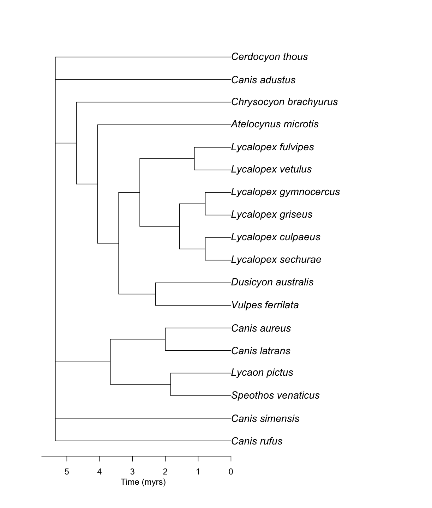
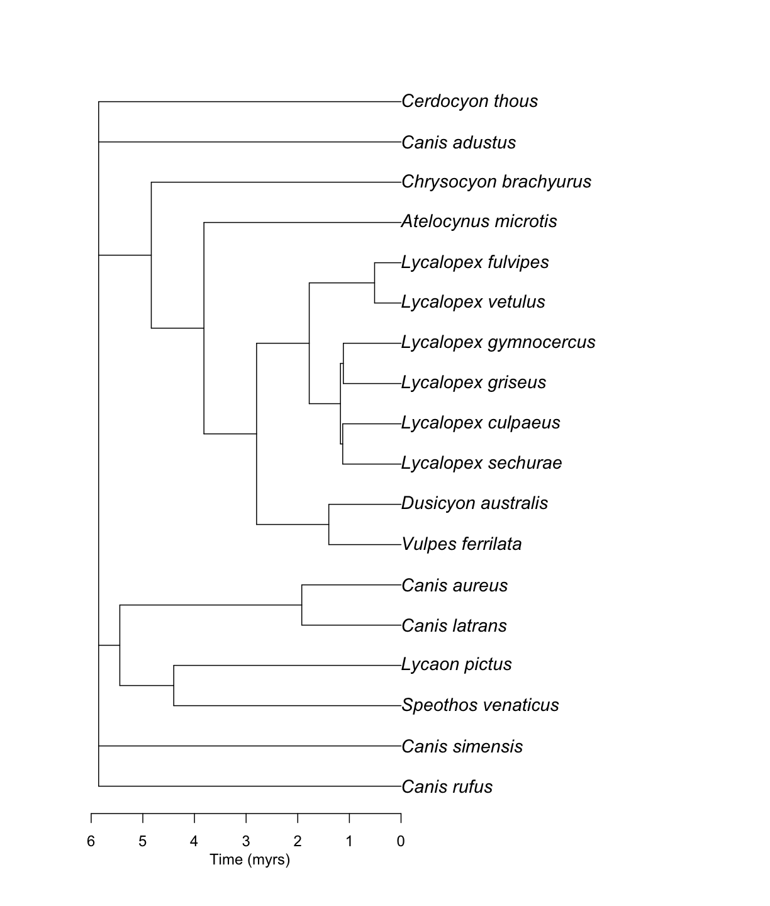

---
# Please do not edit this file directly; it is auto generated.
# Instead, please edit 07-age-summary.md in _episodes_rmd/
source: Rmd
title: "7. Summarizing branch length information"
teaching: 5
exercises: 5
questions:
- "How do I summarize infromation from different source chronograms?"
- "How do I choose a preferred source chronogram?"
objectives:
- "Understanding the depth of uncertainty around age estimates."
keypoints:
- "Source chronograms have a wide range of variation in age estimates."
---

We can summarize it.

~~~
canis_phylo_median <-  datelife::summarize_datelife_result(canis_dr, summary_format = "phylo_median")
~~~
{: .language-r}

~~~
canis_phylo_median
~~~
{: .language-r}

Phylogenetic tree with 18 tips and 13 internal nodes.

Tip labels:
	Canis_rufus, Canis_simensis, Speothos_venaticus, Lycaon_pictus, Canis_latrans, Canis_aureus, ...
Node labels:
	n1, n2, n3, n4, n5, n6, ...

Unrooted; includes branch lengths.

~~~
ape::plot.phylo(canis_phylo_median, cex = 1.2)
ape::axisPhylo()
~~~
{: .language-r}

> ## Challenge! Get other types of summary opentree_chronograms
>
> > Hint: Use the argument summary_format = "phylo_sdm" from the funtion `summarize_datelife_result()`
> >
> > ## Solution
> > 
> > ~~~
> > canis_phylo_sdm <-  datelife::summarize_datelife_result(canis_dr, summary_format = "phylo_sdm")
> > ~~~
> > {: .language-r}
> > 
> > ~~~
> > canis_phylo_sdm
> > ~~~
> > {: .language-r}
> > 
> > 
> > Phylogenetic tree with 18 tips and 13 internal nodes.
> > 
> > Tip labels:
> > 	Canis_rufus, Canis_simensis, Speothos_venaticus, Lycaon_pictus, Canis_latrans, Canis_aureus, ...
> > Node labels:
> > 	n1, n2, n3, n4, n5, n6, ...
> > 
> > Unrooted; includes branch lengths.
> > 
> > 
> > ~~~
> > ape::plot.phylo(canis_phylo_sdm, cex = 1.2)
> > ape::axisPhylo()
> > ~~~
> > {: .language-r}
> > 
> > 
> {: .solution}
{: .challenge}

#### You can also try the web browser of [datelife](http://datelife.org/query/).
